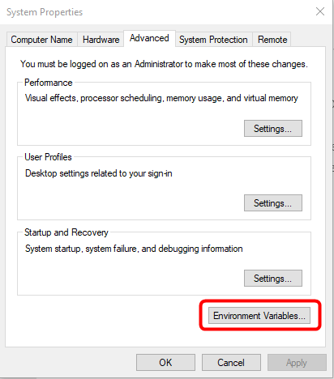
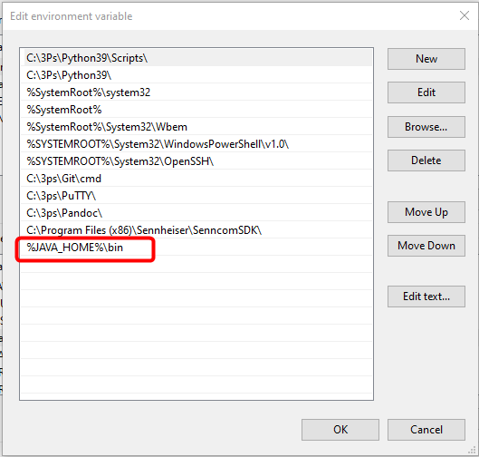
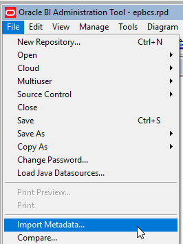
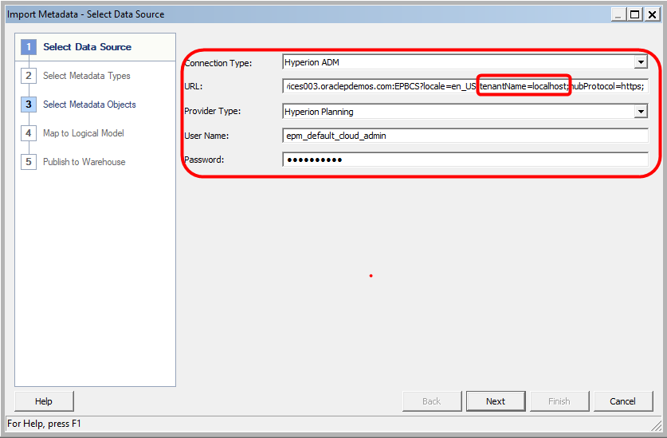
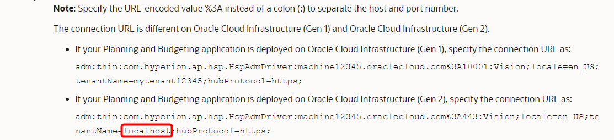
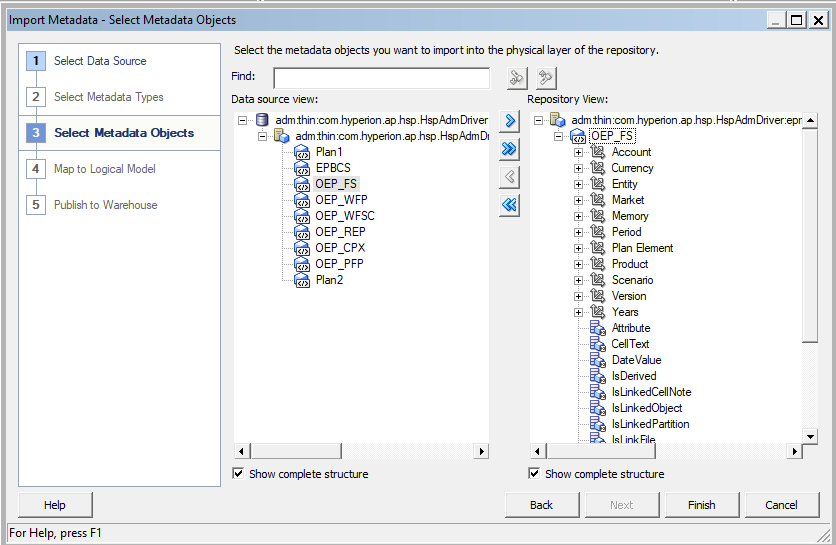
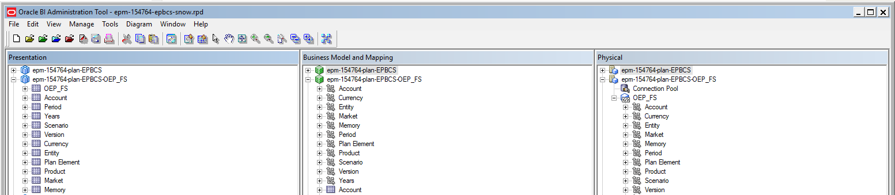

## **Introduction**

Model EPBCS in an RPD in the BI Client Tool (admintool.exe) using a local JAVAHOST

## **Documentation Links**

**Doc Link:** <https://docs.oracle.com/en/cloud/paas/analytics-cloud/acabi/integrate-oracle-enterprise-performance-management-applications.html#GUID-876DF464-68A7-40A0-8BA6-7D2EB0357501>

**Support Doc:** <https://support.oracle.com/epmos/faces/DocContentDisplay?id=2342461.1>

## **Step 1: Download/Install JDK 8u301**

1.  Download the desired version from <https://www.oracle.com/java/technologies/javase/javase-jdk8-downloads.html>

2.  Create **JAVA\_HOME** environment variables (Control Panel-\>System-\>Advance system settings)

3.  Update the **Path** variable to include the **%JAVA\_HOME%\\bin**

    

    

    

## **Step 2: Download/Install the OAC Client Tools**

4.  Download the desired version of the OAC Client Tools from <https://www.oracle.com/middleware/technologies/oac-tools-downloads.html>

5.  Make note of where you installed the Client Tools, this will be referenced as the **BIClient\_Home** in this example it is **C:\\Oracle\\Middleware\\Oracle\_Home\\\...**

## **Step 3: Configure the admintool.cmd file**

6.  Edit the **admintool.cmd**

    Located here - **BIClient\_Home**\\bi\\bitools\\bin\\admintool.cmd

7.  Add **set INSTANCE\_NAME=%DOMAIN\_HOME%** to the file

    

## **Step 4: Start the local JAVAHOST**

8.  Navigate to **BIClient\_Home**\\bi\\bifoundation\\javahost\\bin

9.  Run the **startOnClient.bat** command script. Run the script a second time to confirm it is running

    

## **Step 5: Import EPBCS Metadata into RPD**

10. Open the Admin Tool and select **File-\>Import Metadata**

    

11. Select/Enter the following values

    

    **Note:** Be sure to take note of the documentation as it relates to the ADM URL

    

12. Select the desired EPBCS Applications and Click **Finish**

    

    

13. Replace Data Model in OAC

## **Step 6: Test Subject Area in DV**

14. Add Data Set from Subject Area

    

15. Create Visualization
    
    

## **Log Files Locations**

### JAVAHOST Log File

```
<BIClient_Home>\domains\bi\servers\obijh1\logs\jh.log
```

### Admin Tool Log File

```
<BIClient_Home>\domains\bi\servers\obis1\logs\<win_user_name>\_NQSAdminTool.log
```
