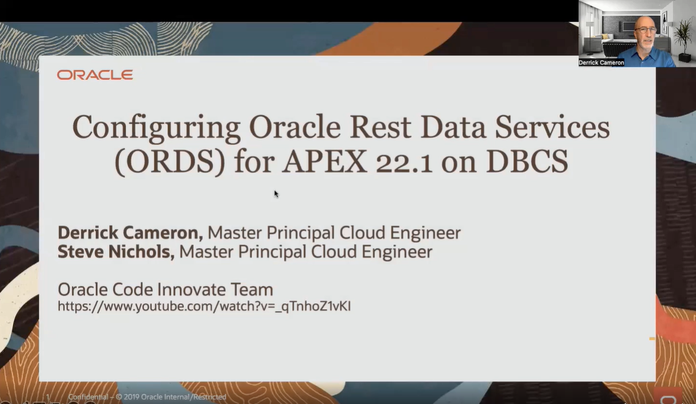

## **Introduction**

Install APEX into a DBCS Instance and ORDS into a Compute Instance

## **Youtube Recording**

[](https://www.youtube.com/watch?v=_qTnhoZ1vKI)

## **Documentation Links**

1.  APEX Documentation

    [APEX Install](https://docs.oracle.com/en/database/oracle/apex/22.1/htmig/downloading-installing-apex.html#GUID-B5A5B38D-586C-488A-AE27-A168FAA28FEE)

    [APEX Verify Install](https://support.oracle.com/cloud/faces/DocumentDisplay?id=1254932.1)

    [Remove Previous Versions of APEX - 555624.1](https://support.oracle.com/cloud/faces/DocumentDisplay?id=555624.1)

    [Remove Previous Versions of APEX - 558340.1](https://support.oracle.com/cloud/faces/DocumentDisplay?id=558340.1)

2.  ORDS Documentation

    [ORDS Install](https://docs.oracle.com/en/database/oracle/oracle-rest-data-services/22.2/ordig/installing-and-configuring-oracle-rest-data-services.html#GUID-B6661F35-3EE3-4CB3-9379-40D0B8E24635)

    [ORDS Install Password Validation Error](https://support.oracle.com/cloud/faces/DocumentDisplay?id=2408087.1)

## **Step 1: SSH into Compute Instance**

1. Issue SSH command

    ```
    <copy>
    ssh -i {ssh_private_key} opc@{compute_public_ip}
    </copy>
    ```

## **Step 2: Install JAVA JDK into Compute Instance**

1. Yum install JAVA and verify version 

	```
    <copy>
	sudo yum install jdk-17.x86_64 
	java --version
	</copy>
	```

## **Step 3: Install Instant Client into Compute Instance and Verify**

1. Yum install Instant Client and test SQL*Plus Connection
	```
    <copy>
    sudo yum install oracle-instantclient-release-el8  
    sudo yum install oracle-instantclient-sqlplus
    sqlplus username/password@//[host]:[port]/[service_name]
	</copy>
	```

## **Step 4: Install ORDS into Compute Instance**

1. Yum install ORDS and verify version

    **Note:**  This also creates linux user:group ORACLE:OINSTALL

	```
    <copy>
    sudo yum install ords
    ords --version
	</copy>
	```

## **Step 5: Install APEX into DBCS PDB from Compute Instance**

1. Download and Unzip APEX Software
    ```
    <copy>
    sudo su - oracle
    wget https://download.oracle.com/otn_software/apex/apex_22.1.zip
    unzip apex_22.1.zip
    cd apex
    </copy>
    ```

2.  Install APEX

	```
    <copy>
    sqlplus username/password@//[host]:[port]/[service_name]
    @apexins.sql SYSAUX SYSAUX TEMP /i/
    </copy>
    ```

    **Note:**  APEX Install Log will reside in the following directory **/home/oracle/apex/install{timestamp}.log**

 3.  Set APEX ADMIN Password

    **Note:**  You will enter a new password for the APEX Administrator User **ADMIN**

	```
    <copy>
    sqlplus username/password@//[host]:[port]/[service_name]
    @apxchpwd.sql
    </copy>
    ```

 4.  Unlock APEX\_PUBLIC\_USER account and set password

	```
    <copy>
    sqlplus username/password@//[host]:[port]/[service_name]
    ALTER USER APEX_PUBLIC_USER ACCOUNT UNLOCK;
    ALTER USER APEX_PUBLIC_USER IDENTIFIED BY "[new_password_here]";
    </copy>
    ```

5.  APEX REST Config

    **Note:**  You will enter a new password for users **APEX\_LISTENER, APEX\_REST\_PUBLIC_USER**

	```
    <copy>
    sqlplus username/password@//[host]:[port]/[service_name]
    @apex_rest_config.sql
    </copy>
    ```

## **Step 6: Install and Config ORDS into Compute Instance and DBCS PDB**
 
 1. Alter PASSWORD\_VERIFY\_FUNCTION (**May not be Required**)

    You may recieve errors related to strong passwords when install ORDS.  Please see the above documentation link **ORDS Install Password Validation Error**.  

    ```
    ORA-28003: password verification for the specified password failed
    ```

    If you recieve an error similar to the one above, follow the below steps to view, unset and reset after ORDS installation the **PASSWORD\_VERIFY\_FUNCTION**

	```
    <copy>
    sqlplus username/password@//[host]:[port]/[service_name]
    select limit from dba_profiles where profile='DEFAULT' and resource_name='PASSWORD_VERIFY_FUNCTION';
    alter profile default limit password_verify_function null;
    alter profile default limit password_verify_function ORA12C_STRONG_VERIFY_FUNCTION;
    </copy>
    ```

2. Set Oracle User BASH Profile

	```
    <copy>
    sudo su - oracle
    echo -e 'export PATH="$PATH:/opt/oracle/ords/bin"' >> ~/.bash_profile
    </copy>
    ```

3. Open the firewall on the Compute Instance and update the VCN for the ORDS Port

    As linux user OPC

    ```
    <copy>
    sudo firewall-cmd --list-all
    sudo firewall-cmd --zone=public --add-port=8443/tcp --permanent
    sudo firewall-cmd --reload
    </copy>
    ```

4. Install and Config ORDS

    **Note:**  This will execute Interactive-Command-Line Interface Installation, for more details, see the documentation [here](https://docs.oracle.com/en/database/oracle/oracle-rest-data-services/22.2/ordig/installing-and-configuring-oracle-rest-data-services.html#GUID-8580F2DC-8D8F-47A0-A733-E1BF07CA27A6)

    **Note**  Once the below command is finished executing, **DO NOT CLOSE**  the command window.  ORDS is now running in the foreground.

	```
    <copy>
    ords --config /etc/ords/config install
    </copy>
    ```

## **Step 7: Test APEX and ORDS from Local Browser**

If the following tests are not successful, please refer to the **APEX Verify Install** link under the Documentation section above.  You may need to remove previous versions of APEX

1.  Test APEX Admin

    * **WORKSPACE:** INTERNAL
    * **USERNAME:**  ADMIN     
    * **PASSWORD**   from Step 5.3 - apxchpwd.sql script

	```
    <copy>
    https://[compute_ip_address]:[port]/ords/apex_admin
    </copy>
    ```

2.  Test APEX

	```
    <copy>
    https://[compute_ip_address]:[port]/ords/
    </copy>
    ```

3.  Test ORDS-Database Actions

    **Note:**  Once you have a REST Enabled Schema Created, you can access **Database Actions** using that schema's credentials.

	```
    <copy>
    https://[compute_ip_address]:[port]/ords/sql-developer
    </copy>
    ```
