# Oracle Autonomous AI Database at Azure

## Introduction

Are you interested in how Oracle 26ai, running natively on Azure can enhance and accelerate your next development project?  This half day developer experience will coach you through getting your first Autonomous AI Database up and running in Azure, how to load data and configure Visual Studio Code for rapid Application Development in six modern programming languaes. 

Oracle Database@Azure is a cloud database service that runs Oracle Database workloads in your Azure environment. All hardware for Oracle Database@Azure is colocated in Azure's data centers and uses Azure networking. The service benefits from the simplicity, security, and low latency of a single operating environment within Azure. Federated identity and access management for Oracle Database@Azure is provided by Microsoft Entra ID.

In this Workshop, we’ll explore the following:

* Deploy a Serverless Autonomous AI Database Instance from the Azure Portal
* Connect to the Autonomous AI Database Using Visual Studio Code
* Install Oracle Instant Client
* Create Autonomous AI Database Objects (user, table, load data)
* Leverage Common Programming Languages to Manipulate Data in the Autonomous AI Database
    * .NET 
    * Node.js
    * Python
    * GO
    * Rust
    * Ruby

## Documentation 

<https://learn.microsoft.com/en-us/azure/oracle/>

<https://azuremarketplace.microsoft.com/en-us/marketplace/apps/oracle.oracle_database_at_azure?tab=Overview>

<https://www.oracle.com/cloud/azure/oracle-database-at-azure/>

<https://docs.oracle.com/en-us/iaas/Content/database-at-azure/oaa.htm>

## Prerequisites

To perform this lab you must first enable Oracle Database@Azure in your tenancy. This simple process begins by contacting your Oracle's sales team. The Oracle team can then create an Azure Private Offer inside the Azure Marketplace for your organization, once accepted you simply complete the purchase inside the Azure portal's Marketplace service and are able to begin your development journey. 

Please reference the below links to complete all the Onboarding Steps.  

<https://learn.microsoft.com/en-us/azure/oracle/oracle-db/onboard-oracle-database>

<https://learn.microsoft.com/en-us/azure/oracle/oracle-azure-overview>

<https://docs.oracle.com/en-us/iaas/Content/database-at-azure/oaaprerequisites.htm>

## Task 1: Provision Autonomous AI Database via Azure Portal and Download Wallet

1. Log Into Azure Portal

    <https://portal.azure.com/>
    
2. Click on All Services

    

    then Databases, Oracle Database@Azure

    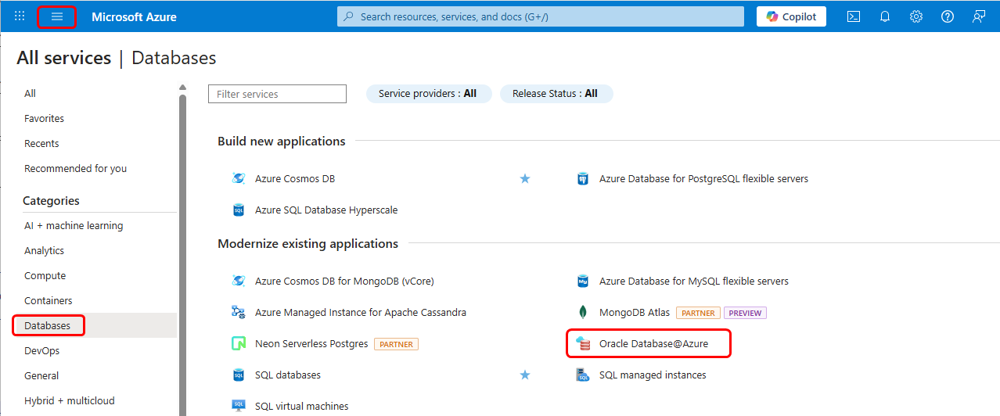

3. Click on Create an Oracle Autonomous Database

    

4. Select Subscription and either create a new or select a Resource Group, 
    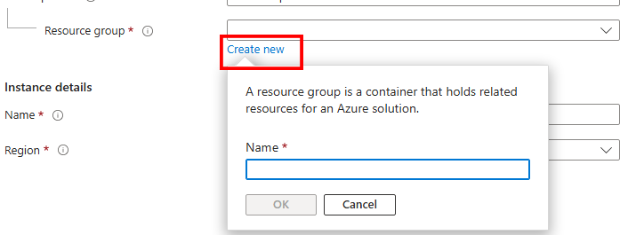

    Then enter a Name and Select a Region

    

5. Select Workload Type, Database Version and Enter Admin Password.

    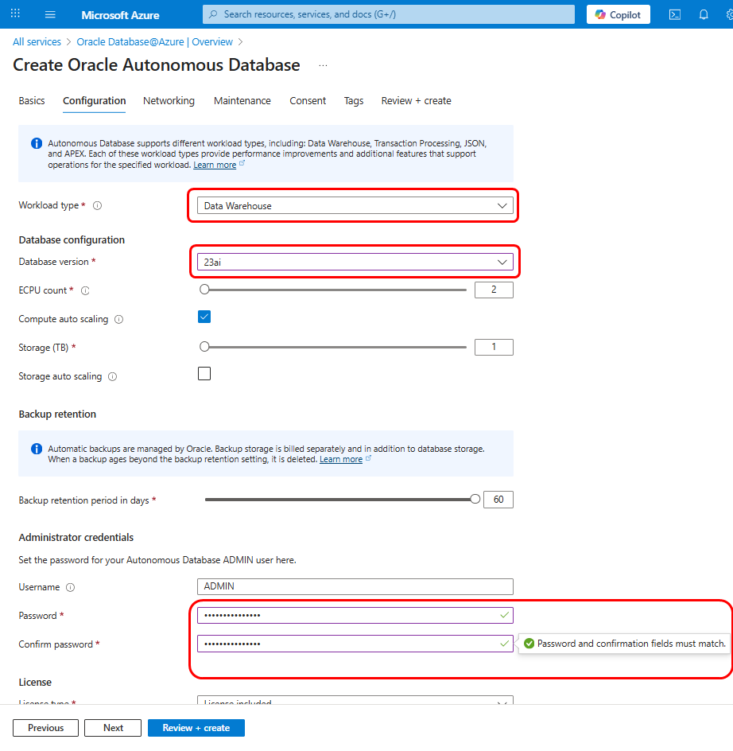

    Leave the default for License included. 
    

6. Accept the Defaults for Networking

    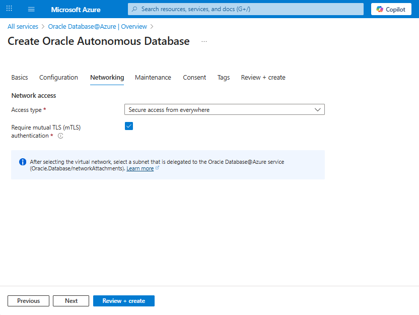

7. Accept the Defaults for Maintenance

    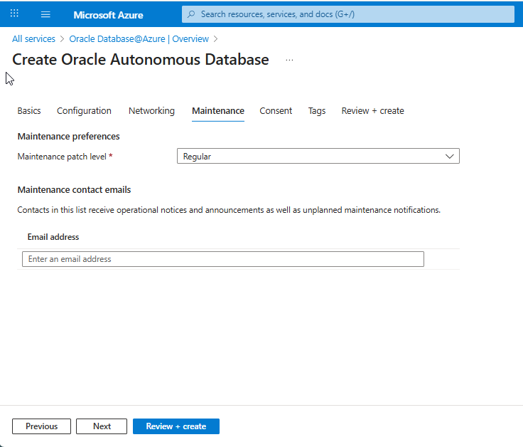

    **Note:** Accept **Regular** as the default.  If you would like **Early**, be sure to verify this option is available in the region you selected earlier.

8. Accept Defaults for Consent

    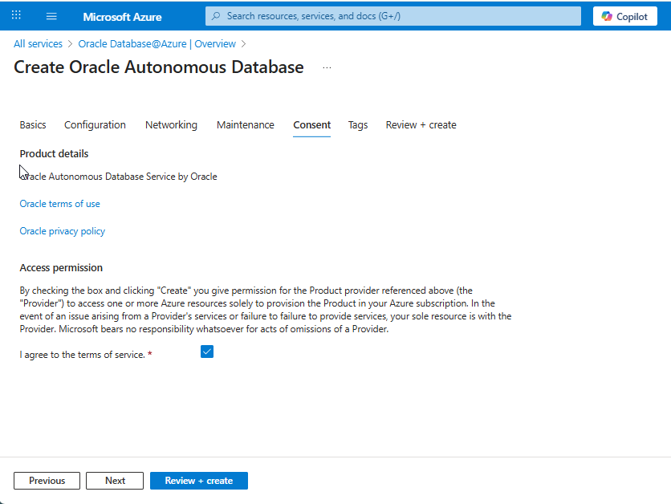

9. Accept Default for Tags

    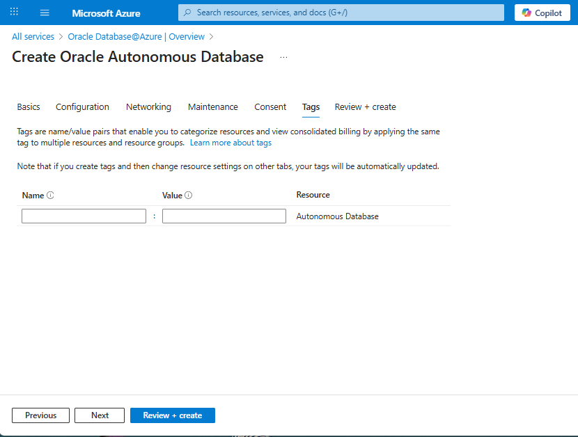

10. Click Create at Review + Create

    

11. The Deployment is **in progress**

    

12. The Deployment is **complete**, Click Go to Resource

    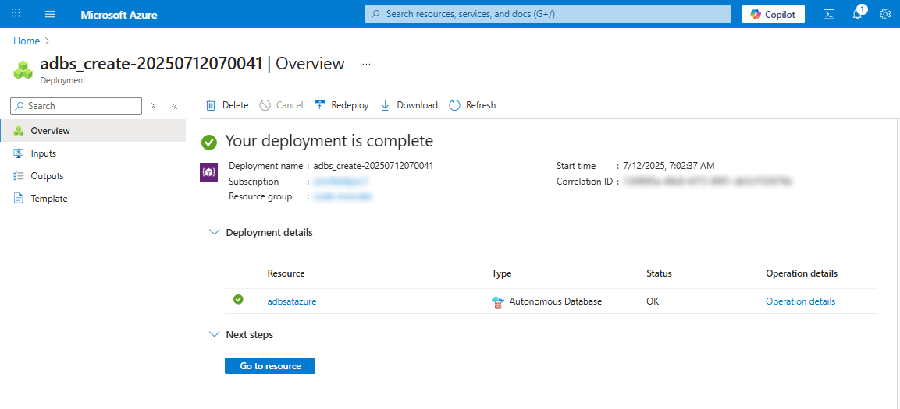

13. Select the Autonomous Database you just created

    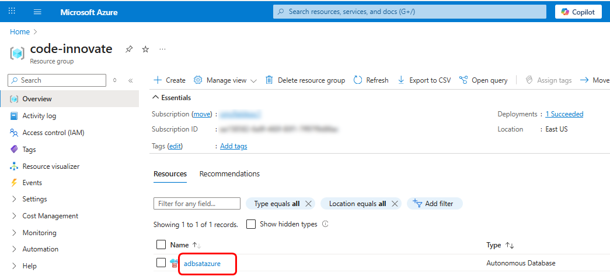

14. Here you can click on **Connections** to Download the Wallet. If you need to navigate to the Oracle Cloud Infrastructure console you can click **Go to OCI**. 

    

15. Click on Download Wallet

    

16. Enter a password and Click Download

    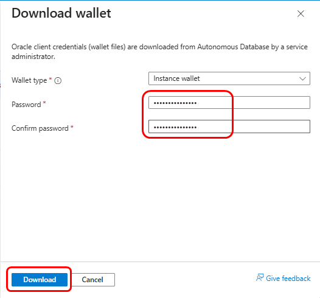
    
17. Copy Wallet Zip File to Desired Location and Unzip it (e.g., C:\\adbs\_at\_azure\\adb_wallets\\)

    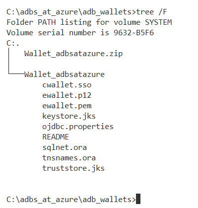

18. Reference links for the steps in Task 1. 
<https://learn.microsoft.com/en-us/azure/oracle/oracle-db/oracle-database-provision-autonomous-database>

<https://docs.oracle.com/en-us/iaas/Content/database-at-azure-autonomous/odadb-provisioning-autonomous-database-azure.html>

## Task 2: Install VSCode, Oracle SQL Developer Extension for VSCode, Define and Test Connection

1. Download and Install Visual Studio Code

    <https://code.visualstudio.com/download>
    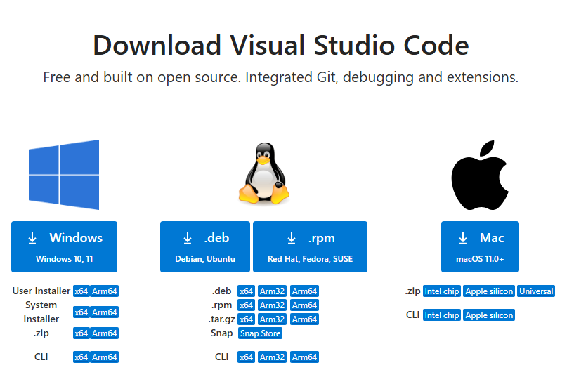

2. Install Oracle SQL Developer Extension for VSCode

    <https://docs.oracle.com/en/database/oracle/sql-developer-vscode/23.4/sqdnx/installing-oracle-sql-developer-vs-code.html>

3. Click Create Connection

    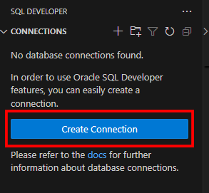

    Enter the **ADMIN** username and **PASSWORD** then select the WALLET.zip file downloaded in Task 1 as the configuration file. Click **TEST** and if successful **SAVE** to complete the setup. 

        

4. Open SQL Worksheet. 

    

    Execute the SQL Statement Below to Retrieve Session Timezone from Autonomous AI Database

    ```
    <copy>
    select sessiontimezone from dual;
    </copy>
    ```
    
    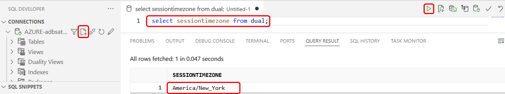    

    **Note:** Make note of the value returned, you will enter it in the sample **GO** application below

5. When prompted select **NO** for the SQL LLM prompt. 

    

6. Below are reference links for the actions above.

    <https://docs.oracle.com/en/database/oracle/sql-developer-vscode/23.4/sqdnx/connecting-your-database.html>

## Task 2a: Install and Setup SQLcl MCP Server included with Oracle SQL Developer Extension for VSCode (Optional)

The steps in this task are optional and not required to complete the other core tasks below. This task leverages the Oracle SQLcl Model Context Protocol (MCP) Server to transform how you interact with the Oracle Database by enabling seamless communication with Artificial Intelligence (AI) applications. The plugin's MCP server enables you to perform operations, create reports, and run queries on Oracle Database using natural language through AI-powered interactions. 

**Caution** When you grant a large language model (LLM) access to your database, it introduces significant security risks. Because LLMs use the data you input to generate responses, you might inadvertently expose unintended tables or sensitive details.  Please refere to the below link for additional details and **Warnings**.

[Using the Oracle SQLcl MCP Server] (https://docs.oracle.com/en/database/oracle/sql-developer-vscode/25.2/sqdnx/using-oracle-sqlcl-mcp-server.html)

1. Watch the video below to see the required steps for configuring the MCP server, logging in to github copilot and connecting to your DB@Azure in your environment before performing any actions. If you would like to proceed, replicate the steps in your development environment. 

    [Zero to Vibe Coding on Autonomous Database in 5 Minutes](youtube:TvQb7H11zYM)

2. Refer to the following Oracle documentation for **Preparing Your Environment** for more information or advanced configurations. 

    [Preparing Your Environment] (https://docs.oracle.com/en/database/oracle/sql-developer-vscode/25.2/sqdnx/preparing-your-environment.html)

3. For a more detailed look at the MCP server and VS Code plugin, please reference the below YouTube recording below.

    [Introducing SQL Developer Copilot Integration in Microsoft VSCode & MCP Support for Oracle Database](youtube:hj6WoZVGUBg)

## Task 3: Download and Install Oracle Instant Client

1. Download Oracle Instant Client and Basic Package and SQL\*Plus Package

    <https://www.oracle.com/database/technologies/instant-client/downloads.html>

    

2. Unzip the downloaded files to the desired location (e.g., C:\\Oracle\\instantclient\_23\_8)    

    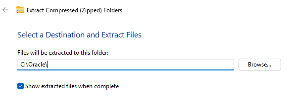

    When extracting if you are prompted for file duplication select to skip the files. 

    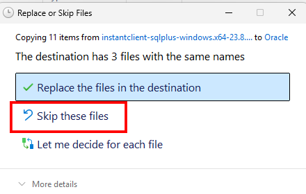

3. Copy the **tnsnames.ora**, **cwallet.sso** and **sqlnet.ora** files from the downloaded wallet into the directory **C:\\Oracle\\instantclient\_23\_8\\network\\admin**

    

4. Open the **tnsnames.ora** file you copied over in a text editor. Copy your connection name. (e.g. **adbsatazure_high**)

    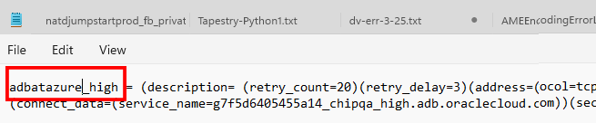

5. Test Connection Using SQL\*Plus 

    ```
    <copy>
    cd C:\Oracle\instantclient_23_8
    sqlplus admin/<your password>@<your connection name>
    </copy>
    ```

    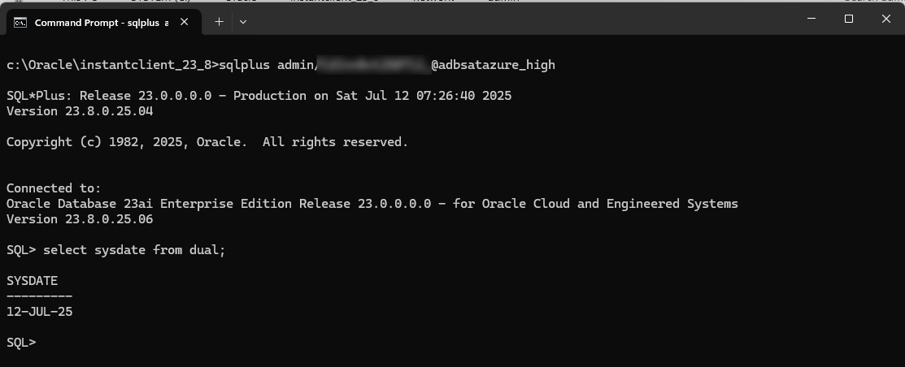

## Task 4: Create Autonomous AI Database User with Grants

Navigate back to SQL Developer in Visual Studio Code. As the user **ADMIN**, issue the below SQL Statements

1. Create Database User and Initial Grants

    ```
    <copy>
    create user adbsatazure identified by "{password}";
    grant dwrole to adbsatazure;
    grant unlimited tablespace to adbsatazure;
    </copy>
    ```

    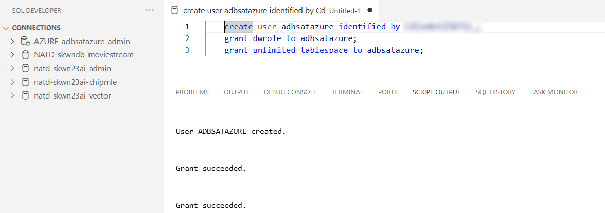

2. Click the plus sign to create a new connection. 

   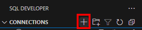

    Create a New SQL Developer Connection in VSCode for database user **adbsatazure**

        

## Task 5: Load Sample Data into Autonomous AI Database

As the user **adbsatazure**, issue the below SQL Statements

1. Create Employees Table

    ```
    <copy>
    CREATE TABLE employees (
        id NUMBER generated by default on null as identity minvalue 1 maxvalue 9999999999999999999999999999 increment by 1 start with 51 cache 20 noorder  nocycle  nokeep  noscale  not null enable,
        first_name VARCHAR2(50),
        last_name VARCHAR2(50),
        email VARCHAR2(100),
        salary NUMBER,
        primary key (id)
    );
    </copy>
    ```

    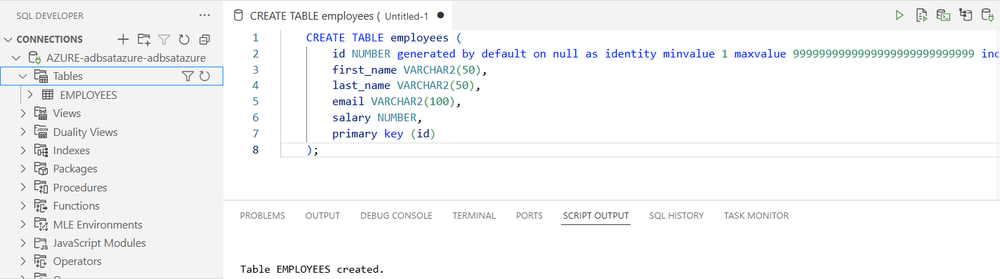    

2. Paste into SQL*Worksheet the Insert Statements below Load Data into Employees Table.

    ```
    <copy>
    INSERT INTO employees (id, first_name, last_name, email, salary) VALUES (1, 'John', 'Doe', 'john.doe@email.com', 50000);
    INSERT INTO employees (id, first_name, last_name, email, salary) VALUES (2, 'Jane', 'Smith', 'jane.smith@email.com', 60000);
    INSERT INTO employees (id, first_name, last_name, email, salary) VALUES (3, 'Michael', 'Johnson', 'michael.j@email.com', 55000);
    INSERT INTO employees (id, first_name, last_name, email, salary) VALUES (4, 'Emily', 'Brown', 'emily.brown@email.com', 52000);
    INSERT INTO employees (id, first_name, last_name, email, salary) VALUES (5, 'David', 'Wilson', 'david.wilson@email.com', 58000);
    INSERT INTO employees (id, first_name, last_name, email, salary) VALUES (6, 'Sarah', 'Davis', 'sarah.davis@email.com', 62000);
    INSERT INTO employees (id, first_name, last_name, email, salary) VALUES (7, 'Robert', 'Taylor', 'robert.taylor@email.com', 53000);
    INSERT INTO employees (id, first_name, last_name, email, salary) VALUES (8, 'Lisa', 'Anderson', 'lisa.anderson@email.com', 59000);
    INSERT INTO employees (id, first_name, last_name, email, salary) VALUES (9, 'James', 'Martinez', 'james.m@email.com', 64000);
    INSERT INTO employees (id, first_name, last_name, email, salary) VALUES (10, 'Anna', 'Thompson', 'anna.thompson@email.com', 51000);
    INSERT INTO employees (id, first_name, last_name, email, salary) VALUES (11, 'Brian', 'Garcia', 'brian.garcia@email.com', 57000);
    INSERT INTO employees (id, first_name, last_name, email, salary) VALUES (12, 'Laura', 'Rodriguez', 'laura.r@email.com', 61000);
    INSERT INTO employees (id, first_name, last_name, email, salary) VALUES (13, 'Kevin', 'Lee', 'kevin.lee@email.com', 54000);
    INSERT INTO employees (id, first_name, last_name, email, salary) VALUES (14, 'Michelle', 'Walker', 'michelle.w@email.com', 63000);
    INSERT INTO employees (id, first_name, last_name, email, salary) VALUES (15, 'Daniel', 'Hall', 'daniel.hall@email.com', 56000);
    INSERT INTO employees (id, first_name, last_name, email, salary) VALUES (16, 'Jessica', 'Allen', 'jessica.allen@email.com', 65000);
    INSERT INTO employees (id, first_name, last_name, email, salary) VALUES (17, 'Mark', 'Young', 'mark.young@email.com', 52000);
    INSERT INTO employees (id, first_name, last_name, email, salary) VALUES (18, 'Rachel', 'King', 'rachel.king@email.com', 60000);
    INSERT INTO employees (id, first_name, last_name, email, salary) VALUES (19, 'Thomas', 'Wright', 'thomas.w@email.com', 58000);
    INSERT INTO employees (id, first_name, last_name, email, salary) VALUES (20, 'Amanda', 'Scott', 'amanda.scott@email.com', 55000);
    INSERT INTO employees (id, first_name, last_name, email, salary) VALUES (21, 'Steven', 'Green', 'steven.green@email.com', 62000);
    INSERT INTO employees (id, first_name, last_name, email, salary) VALUES (22, 'Melissa', 'Adams', 'melissa.adams@email.com', 53000);
    INSERT INTO employees (id, first_name, last_name, email, salary) VALUES (23, 'Andrew', 'Baker', 'andrew.baker@email.com', 59000);
    INSERT INTO employees (id, first_name, last_name, email, salary) VALUES (24, 'Stephanie', 'Gonzalez', 'stephanie.g@email.com', 64000);
    INSERT INTO employees (id, first_name, last_name, email, salary) VALUES (25, 'Christopher', 'Nelson', 'chris.nelson@email.com', 51000);
    INSERT INTO employees (id, first_name, last_name, email, salary) VALUES (26, 'Jennifer', 'Carter', 'jennifer.c@email.com', 57000);
    INSERT INTO employees (id, first_name, last_name, email, salary) VALUES (27, 'Anthony', 'Mitchell', 'anthony.m@email.com', 61000);
    INSERT INTO employees (id, first_name, last_name, email, salary) VALUES (28, 'Rebecca', 'Perez', 'rebecca.p@email.com', 54000);
    INSERT INTO employees (id, first_name, last_name, email, salary) VALUES (29, 'Patrick', 'Roberts', 'patrick.r@email.com', 63000);
    INSERT INTO employees (id, first_name, last_name, email, salary) VALUES (30, 'Elizabeth', 'Turner', 'elizabeth.t@email.com', 56000);
    INSERT INTO employees (id, first_name, last_name, email, salary) VALUES (31, 'Ryan', 'Phillips', 'ryan.p@email.com', 65000);
    INSERT INTO employees (id, first_name, last_name, email, salary) VALUES (32, 'Nicole', 'Campbell', 'nicole.c@email.com', 52000);
    INSERT INTO employees (id, first_name, last_name, email, salary) VALUES (33, 'Justin', 'Parker', 'justin.parker@email.com', 60000);
    INSERT INTO employees (id, first_name, last_name, email, salary) VALUES (34, 'Samantha', 'Evans', 'samantha.e@email.com', 58000);
    INSERT INTO employees (id, first_name, last_name, email, salary) VALUES (35, 'Brandon', 'Edwards', 'brandon.e@email.com', 55000);
    INSERT INTO employees (id, first_name, last_name, email, salary) VALUES (36, 'Kimberly', 'Collins', 'kimberly.c@email.com', 62000);
    INSERT INTO employees (id, first_name, last_name, email, salary) VALUES (37, 'Jason', 'Stewart', 'jason.s@email.com', 53000);
    INSERT INTO employees (id, first_name, last_name, email, salary) VALUES (38, 'Christina', 'Sanchez', 'christina.s@email.com', 59000);
    INSERT INTO employees (id, first_name, last_name, email, salary) VALUES (39, 'Matthew', 'Morris', 'matthew.m@email.com', 64000);
    INSERT INTO employees (id, first_name, last_name, email, salary) VALUES (40, 'Angela', 'Rogers', 'angela.r@email.com', 51000);
    INSERT INTO employees (id, first_name, last_name, email, salary) VALUES (41, 'Gregory', 'Reed', 'gregory.reed@email.com', 57000);
    INSERT INTO employees (id, first_name, last_name, email, salary) VALUES (42, 'Heather', 'Cook', 'heather.cook@email.com', 61000);
    INSERT INTO employees (id, first_name, last_name, email, salary) VALUES (43, 'Jeffrey', 'Morgan', 'jeffrey.m@email.com', 54000);
    INSERT INTO employees (id, first_name, last_name, email, salary) VALUES (44, 'Amy', 'Bell', 'amy.bell@email.com', 63000);
    INSERT INTO employees (id, first_name, last_name, email, salary) VALUES (45, 'Timothy', 'Murphy', 'timothy.m@email.com', 56000);
    INSERT INTO employees (id, first_name, last_name, email, salary) VALUES (46, 'Deborah', 'Bailey', 'deborah.b@email.com', 65000);
    INSERT INTO employees (id, first_name, last_name, email, salary) VALUES (47, 'Charles', 'Rivera', 'charles.r@email.com', 52000);
    INSERT INTO employees (id, first_name, last_name, email, salary) VALUES (48, 'Cynthia', 'Cooper', 'cynthia.c@email.com', 60000);
    INSERT INTO employees (id, first_name, last_name, email, salary) VALUES (49, 'George', 'Richardson', 'george.r@email.com', 58000);
    INSERT INTO employees (id, first_name, last_name, email, salary) VALUES (50, 'Linda', 'Cox', 'linda.cox@email.com', 55000);
    commit;
    </copy>
    ```
    You will need to click the **Run Script** button to execute all the statements at one time. 

    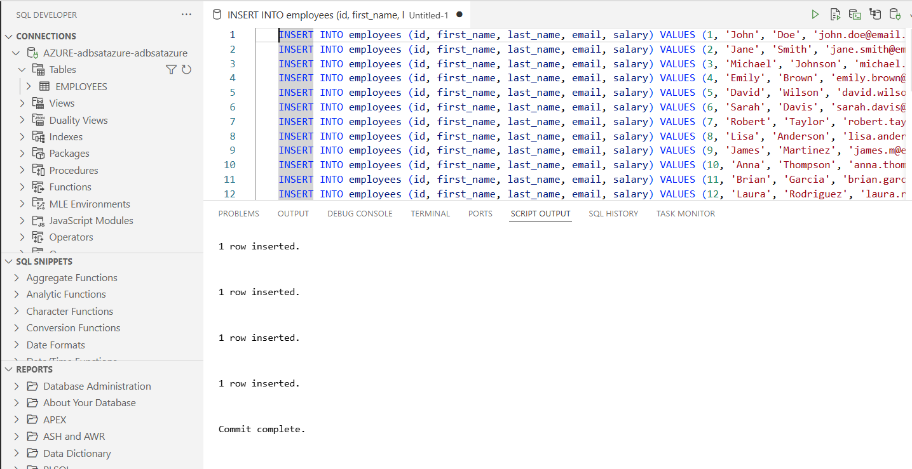    
    
3. View Data in Visual Studio Code
    
    Right-click on **employees** table and select **Open** and select **Data** tab

            

## Task 5a: Using the SQLcl MCP Server to Load Sample Data into ADB-S (Optional)

If you completed **Task 2a: Install and Setup SQLcl MCP Server included with Oracle SQL Developer Extension for VSCode**, follow the below steps to create a table and load sample data into your Oracle Autonomous AI Database@Azure you provisioned in **Task 1: Provision ADB-S via Azure Portal and Download Wallet**.  

**Note:**  If you completed **# Task 5: Load Sample Data into ADB-S** already, the table name in step 3 below should be different.  In addition, if you plan to leverage the table created through the **SQLcl MCP Server** the code samples below will need updated accordinly to match the table created.

1. Using **Github Copilot Chat**, list the SQL Developer Connections Available

    ```
    <copy>
    list connections
    </copy>
    ```

    
    
    Click **Continue** to Proceed.

    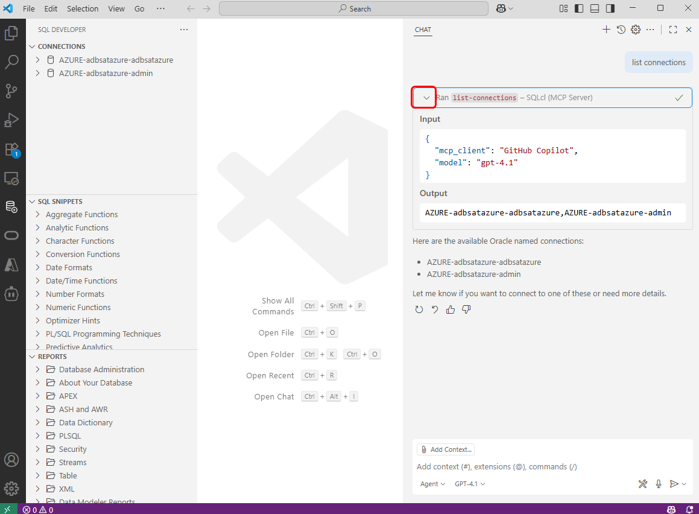

2. Using **Github Copilot Chat**, Connect to the Autonomous AI Database as the user **adbsatazure**

    ```
    <copy>
    connect to adbsatazure
    </copy>
    ```

    

    Click **Continue** to Proceed.
    
    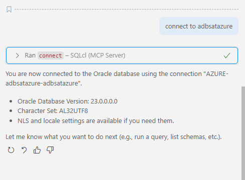

3. Using **Github Copilot Chat**, issue the following to create a table 

    **Note:**  For demonstration purposes, the table name used is **employees_mcp** and does not match the code samples below.

    ```
    <copy>
    create a table named employees_mcp with the following columns: id, first_name, last_name, email, salary. be sure the id column is the primary key and the value auto generated on insert
    </copy>
    ```

    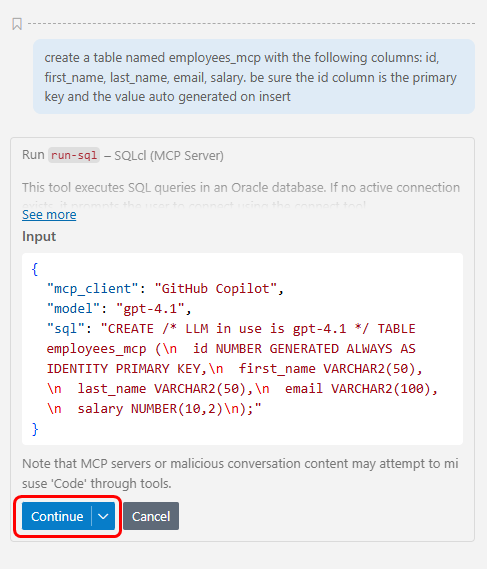

    Click **Continue** to Proceed.
    
    

4. Using **Github Copilot Chat**, issue the following to load sample data   

    ```
    <copy>
    load 25 rows of sample data into the table employees_mcp, be sure to use real first and last names and be sure to issue the commit statement after loading the data 
    </copy>
    ```

    

    Click **Continue** to Proceed.
    
        

    Click **Continue** to Proceed.

        

5. Using **Github Copilot Chat**, issue the following to view the sample data
    
    ```
    <copy>
    show me a 5 rows of data from the emploees-mcp table    
    </copy>
    ```    

    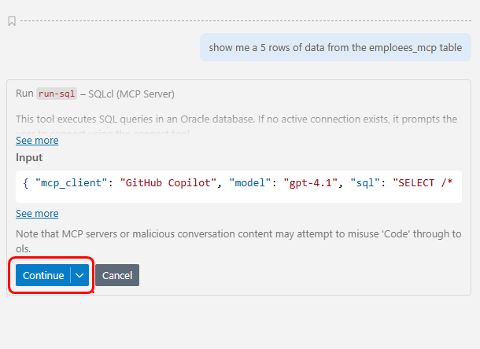       

    Click **Continue** to Proceed.
    
    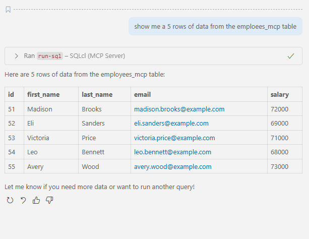       
    
    Here's an alternate view of the data 

               

6. The SQLcl MCP Server activity is captured in the Database in the **DBTOOLS$MCP_LOG** Table

    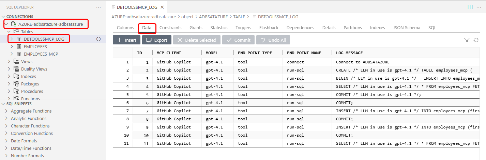           

    The **LOG\_MESSAGE** column contains the SQL Generated and Executed
    
    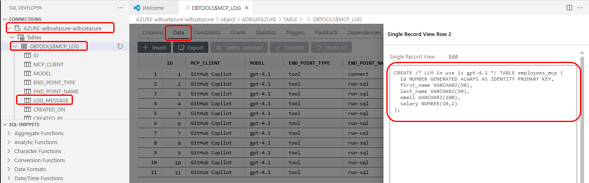           
    
## Task 6: .NET Setup and Sample Application

1. Download and Install .NET SDK the Latest Version of .NET
    Go to:

    <https://dotnet.microsoft.com/download>

    After Download Open the file.

    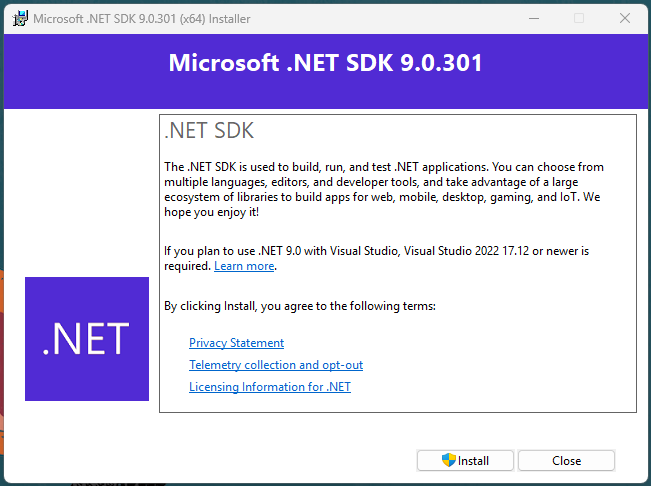

    Click Install

    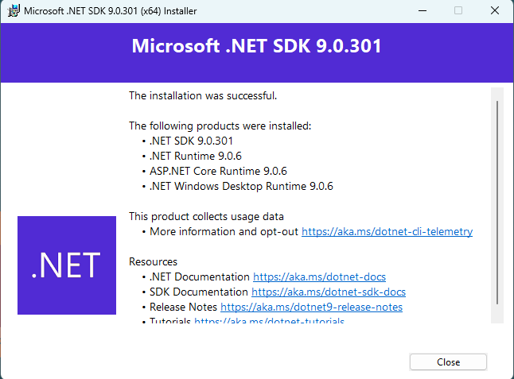

    Click Close

2. Open a New Terminal in VSCode. Please note you may have to close and open the program the first time you install the .Net framework.

    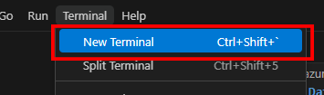

    Verify .NET Environment in VSCode Terminal

    ```
    <copy>
    dotnet --version
    dotnet --list-sdks
    dotnet --list-runtimes
    </copy>
    ```

    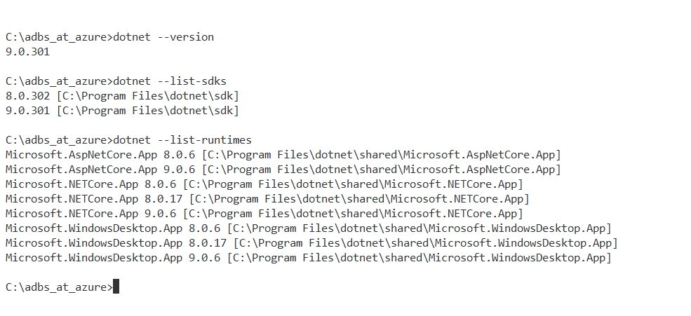

3. Create .NET Environment

    ```
    <copy>
    mkdir c:\adbs_at_azure\oracle_crud_dotnet_app
    cd c:\adbs_at_azure\oracle_crud_dotnet_app
    dotnet new console
    </copy>
    ```

    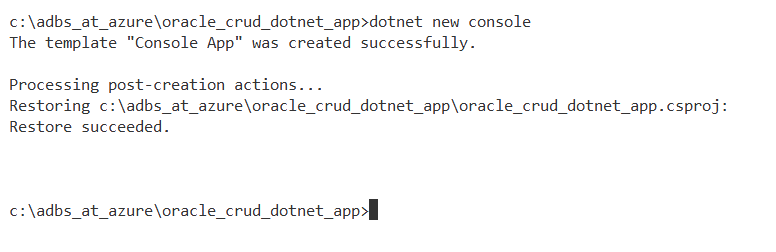

4. Test Hello World Application

    ```
    <copy>
    dotnet run
    </copy>
    ```
    
    

5. Install Oracle Data Provider for .NET by running the command below. 

    ```
    <copy>
    dotnet add package Oracle.ManagedDataAccess.Core
    </copy>
    ```
    
    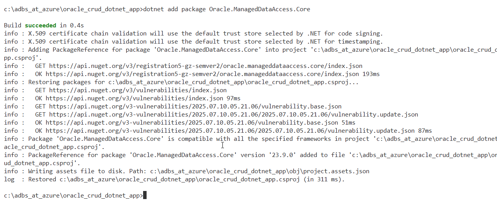

    ```
    <copy>
    dotnet list package    
    </copy>
    ```
    
    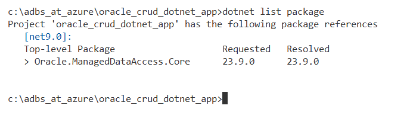

    For more information please visit. 
    
    <https://www.oracle.com/database/technologies/appdev/dotnet/odp.html>

6. Create a new file for your first CRUD application. Name your file **dotnet\_crud\_adbs.cs**

    List the project name then create a new file:
    ```
    <copy>
    New-Item -Name "dotnet_crud_adbs.cs" -ItemType File
    </copy>
    ```

    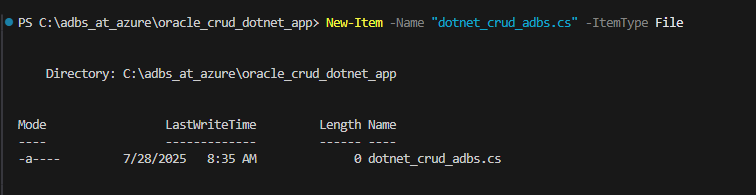

    Open the file in VS Code and paste in the following. **Note:** Please update and verify your Database Username, Password, DSN and TnsAdmin Path on line 9 & 14 in the program code. 

    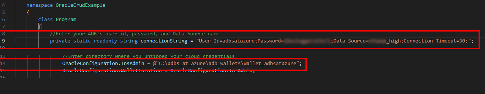

    ```
    <copy>
    using System;
    using Oracle.ManagedDataAccess.Client;

    namespace OracleCrudExample
    {
        class Program
        {
            //Enter your ADB's user id, password, and Data Source name
            private static readonly string connectionString = "User Id=adbsatazure;Password=password;Data Source=adbsatazure_high;Connection Timeout=30;";

            static void Main(string[] args)
            {
                //Enter directory where you unzipped your cloud credentials
                OracleConfiguration.TnsAdmin = @"C:\adbs_at_azure\adb_wallets\Wallet_adbsatazure";
                OracleConfiguration.WalletLocation = OracleConfiguration.TnsAdmin;

                while (true)
                {
                    Console.WriteLine("\nEmployee Management System");
                    Console.WriteLine("1. Create Employee");
                    Console.WriteLine("2. Read All Employees");
                    Console.WriteLine("3. Update Employee");
                    Console.WriteLine("4. Delete Employee");
                    Console.WriteLine("5. Exit");
                    Console.Write("Select an option: ");

                    string choice = Console.ReadLine()!;

                    switch (choice)
                    {
                        case "1":
                            CreateEmployee();
                            break;
                        case "2":
                            ReadEmployees();
                            break;
                        case "3":
                            UpdateEmployee();
                            break;
                        case "4":
                            DeleteEmployee();
                            break;
                        case "5":
                            Environment.Exit(0);
                            break;
                        default:
                            Console.WriteLine("Invalid option. Please try again.");
                            break;
                    }
                }
            }

            static void CreateEmployee()
            {
                try
                {
                    using (OracleConnection conn = new OracleConnection(connectionString))
                    {
                        conn.Open();
                        Console.Write("Enter First Name: ");
                        string firstName = Console.ReadLine()!;
                        Console.Write("Enter Last Name: ");
                        string lastName = Console.ReadLine()!;
                        Console.Write("Enter Email: ");
                        string email = Console.ReadLine()!;
                        Console.Write("Enter Salary: ");
                        decimal salary = Convert.ToDecimal(Console.ReadLine());

                        string sql = "INSERT INTO employees (first_name, last_name, email, salary) VALUES (:firstName, :lastName, :email, :salary)";
                        using (OracleCommand cmd = new OracleCommand(sql, conn))
                        {
                            cmd.Parameters.Add(":firstName", firstName);
                            cmd.Parameters.Add(":lastName", lastName);
                            cmd.Parameters.Add(":email", email);
                            cmd.Parameters.Add(":salary", salary);

                            int rowsAffected = cmd.ExecuteNonQuery();
                            Console.WriteLine($"{rowsAffected} employee(s) created successfully.");
                        }
                    }
                }
                catch (Exception ex)
                {
                    Console.WriteLine($"Error creating employee: {ex.Message}");
                }
            }

            static void ReadEmployees()
            {
                try
                {
                    using (OracleConnection conn = new OracleConnection(connectionString))
                    {
                        conn.Open();
                        string sql = "SELECT id, first_name, last_name, email, salary FROM employees ORDER BY id";
                        using (OracleCommand cmd = new OracleCommand(sql, conn))
                        {
                            using (OracleDataReader reader = cmd.ExecuteReader())
                            {
                                Console.WriteLine("\nEmployee List:");
                                Console.WriteLine("ID\tFirst Name\tLast Name\tEmail\t\t\tSalary");
                                Console.WriteLine("-------------------------------------------------------------");

                                while (reader.Read())
                                {
                                    Console.WriteLine($"{reader["id"]}\t{reader["first_name"]}\t\t{reader["last_name"]}\t\t{reader["email"]}\t\t{reader["salary"]}");
                                }
                            }
                        }
                    }
                }
                catch (Exception ex)
                {
                    Console.WriteLine($"Error reading employees: {ex.Message}");
                }
            }

            static void UpdateEmployee()
            {
                try
                {
                    using (OracleConnection conn = new OracleConnection(connectionString))
                    {
                        conn.Open();
                        Console.Write("Enter Employee ID to update: ");
                        int id = Convert.ToInt32(Console.ReadLine());
                        Console.Write("Enter new First Name: ");
                        string firstName = Console.ReadLine()!;
                        Console.Write("Enter new Last Name: ");
                        string lastName = Console.ReadLine()!;
                        Console.Write("Enter new Email: ");
                        string email = Console.ReadLine()!;
                        Console.Write("Enter new Salary: ");
                        decimal salary = Convert.ToDecimal(Console.ReadLine());

                        string sql = "UPDATE employees SET first_name = :firstName, last_name = :lastName, email = :email, salary = :salary WHERE id = :id";
                        using (OracleCommand cmd = new OracleCommand(sql, conn))
                        {
                            cmd.Parameters.Add(":firstName", firstName);
                            cmd.Parameters.Add(":lastName", lastName);
                            cmd.Parameters.Add(":email", email);
                            cmd.Parameters.Add(":salary", salary);
                            cmd.Parameters.Add(":id", id);

                            int rowsAffected = cmd.ExecuteNonQuery();
                            if (rowsAffected > 0)
                                Console.WriteLine("Employee updated successfully.");
                            else
                                Console.WriteLine("No employee found with the specified ID.");
                        }
                    }
                }
                catch (Exception ex)
                {
                    Console.WriteLine($"Error updating employee: {ex.Message}");
                }
            }

            static void DeleteEmployee()
            {
                try
                {
                    using (OracleConnection conn = new OracleConnection(connectionString))
                    {
                        conn.Open();
                        Console.Write("Enter Employee ID to delete: ");
                        int id = Convert.ToInt32(Console.ReadLine());

                        string sql = "DELETE FROM employees WHERE id = :id";
                        using (OracleCommand cmd = new OracleCommand(sql, conn))
                        {
                            cmd.Parameters.Add(":id", id);

                            int rowsAffected = cmd.ExecuteNonQuery();
                            if (rowsAffected > 0)
                                Console.WriteLine("Employee deleted successfully.");
                            else
                                Console.WriteLine("No employee found with the specified ID.");
                        }
                    }
                }
                catch (Exception ex)
                {
                    Console.WriteLine($"Error deleting employee: {ex.Message}");
                }
            }
        }
    }   
    </copy>
    ```

7. Test .NET Application

    Remove or change the extension of the program.cs file created earlier. Then run your new program. 

    ```
    <copy>
    dotnet run dotnet_crud_adbs.cs
    </copy>
    ```
    
    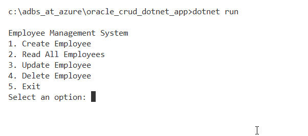

    Create Employee

    

    Read All Employees

    

    Update Employee

    

    Delete Employee

    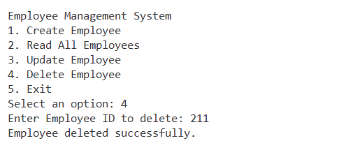

## Task 7: Node.js Setup and Sample Application

1. Download and Install Node.js

    <https://nodejs.org/en/download/>

    ```
    <copy>
    node -v
    </copy>
    ```

    

2. Create Environment and Initialize

    ```
    <copy>
    mkdir c:\adbs_at_azure\oracle_crud_nodejs_app
    cd c:\adbs_at_azure\oracle_crud_nodejs_app
    npm init -y
    </copy>
    ```
    
    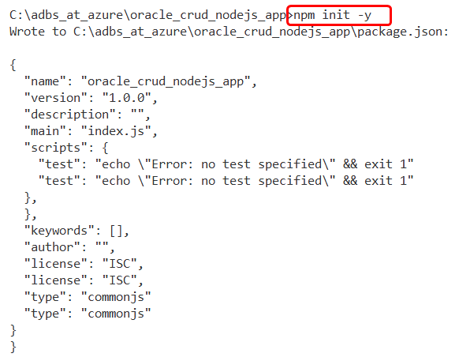

3. Install Node.js Packages oracledb and express

    ```
    <copy>
    npm install express oracledb
    </copy>
    ```
    
    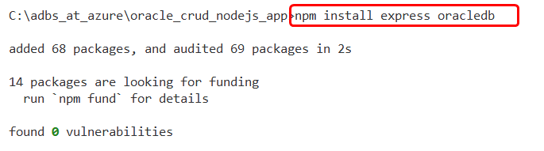

4. Create Node.js Application File **app.js**

    **Note:** Update/Verify Database Username, Password, connectionString, libDir Path and configDir Path

    ```
    <copy>
    const express = require('express');
    const oracledb = require('oracledb');

    const app = express();
    app.use(express.json());

    // Database configuration

    oracledb.initOracleClient({ libDir: 'C:\\Oracle\\instantclient_23_8',
                                    configDir: 'C:\\adbs_at_azure\\adb_wallets\\Wallet_adbsatazure' });

    const dbConfig = {
        user: "adbsatazure",
        password: "password",
        connectString: "adbsatazure_high"
    };

    // Initialize database connection pool
    async function init() {
        try {
            await oracledb.createPool(dbConfig);
            console.log('Database pool created');
        } catch (err) {
            console.error('Error creating database pool:', err);
            process.exit(1);
        }
    }

    // Create (POST) - Add new employee
    app.post('/employees', async (req, res) => {
        let connection;
        try {
            connection = await oracledb.getConnection();
            const { first_name, last_name, email, salary } = req.body;

            const result = await connection.execute(
                `INSERT INTO employees (first_name, last_name, email, salary)
                VALUES (:first_name, :last_name, :email, :salary)
                RETURNING id INTO :id`,
                {
                    first_name,
                    last_name,
                    email,
                    salary,
                    id: { type: oracledb.NUMBER, dir: oracledb.BIND_OUT }
                },
                { autoCommit: true }
            );

            res.status(201).json({
                id: result.outBinds.id[0],
                first_name,
                last_name,
                email,
                salary
            });
        } catch (err) {
            console.error(err);
            res.status(500).json({ error: 'Database error' });
        } finally {
            if (connection) {
                try {
                    await connection.close();
                } catch (err) {
                    console.error(err);
                }
            }
        }
    });

    // Read (GET) - Get all employees
    app.get('/employees', async (req, res) => {
        let connection;
        try {
            connection = await oracledb.getConnection();
            const result = await connection.execute(
                `SELECT id, first_name, last_name, email, salary
                FROM employees
                ORDER BY id`
            );

            res.json(result.rows);
        } catch (err) {
            console.error(err);
            res.status(500).json({ error: 'Database error' });
        } finally {
            if (connection) {
                try {
                    await connection.close();
                } catch (err) {
                    console.error(err);
                }
            }
        }
    });

    // Read (GET) - Get employee by ID
    app.get('/employees/:id', async (req, res) => {
        let connection;
        try {
            connection = await oracledb.getConnection();
            const result = await connection.execute(
                `SELECT id, first_name, last_name, email, salary
                FROM employees
                WHERE id = :id`,
                [req.params.id]
            );

            if (result.rows.length === 0) {
                res.status(404).json({ error: 'Employee not found' });
            } else {
                res.json(result.rows[0]);
            }
        } catch (err) {
            console.error(err);
            res.status(500).json({ error: 'Database error' });
        } finally {
            if (connection) {
                try {
                    await connection.close();
                } catch (err) {
                    console.error(err);
                }
            }
        }
    });

    // Update (PUT) - Update employee
    app.put('/employees/:id', async (req, res) => {
        let connection;
        try {
            connection = await oracledb.getConnection();
            const { first_name, last_name, email, salary } = req.body;
            const result = await connection.execute(
                `UPDATE employees
                SET first_name = :first_name,
                last_name = :last_name,
                email = :email,
                salary = :salary
                WHERE id = :id`,
                {
                    first_name,
                    last_name,
                    email,
                    salary,
                    id: req.params.id
                },
                { autoCommit: true }
            );
            if (result.rowsAffected === 0) {
                res.status(404).json({ error: 'Employee not found' });
            } else {
                res.json({
                    id: parseInt(req.params.id),
                    first_name,
                    last_name,
                    email,
                    salary
                });
            }
        } catch (err) {
            console.error(err);
            res.status(500).json({ error: 'Database error' });
        } finally {
            if (connection) {
                try {
                    await connection.close();
                } catch (err) {
                    console.error(err);
                }
            }
        }
    });

    // Delete (DELETE) - Delete employee
    app.delete('/employees/:id', async (req, res) => {
        let connection;
        try {
            connection = await oracledb.getConnection();
            const result = await connection.execute(
                `DELETE FROM employees WHERE id = :id`,
                [req.params.id],
                { autoCommit: true }
            );
            if (result.rowsAffected === 0) {
                res.status(404).json({ error: 'Employee not found' });
            } else {
                res.status(204).send();
            }
        } catch (err) {
            console.error(err);
            res.status(500).json({ error: 'Database error' });
        } finally {
            if (connection) {
                try {
                    await connection.close();
                } catch (err) {
                    console.error(err);
                }
            }
        }
    });

    // Start the server
    const PORT = process.env.PORT || 3000;
    app.listen(PORT, async () => {
        await init();
        console.log(`Server running on port ${PORT}`);
    });

    // Handle process termination
    process.on('SIGTERM', async () => {
        console.log('SIGTERM received. Closing database pool...');
        await oracledb.getPool().close(0);
        process.exit(0);
    });    
    </copy>
    ```

5. Run Node.js Application

    ```
    <copy>
    node app.js
    </copy>
    ```

    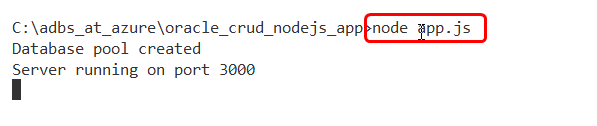

6. Test Node.js Application

    Create Employee Using curl

    ```
    <copy>
    curl --location "http://localhost:3000/employees" --header "Content-Type: application/json" --data-raw "{\"first_name\": \"Jake\",\"last_name\": \"Doe\",\"email\": \"jake.doe@example.com\",\"salary\": 95000}"
    </copy>
    ```

    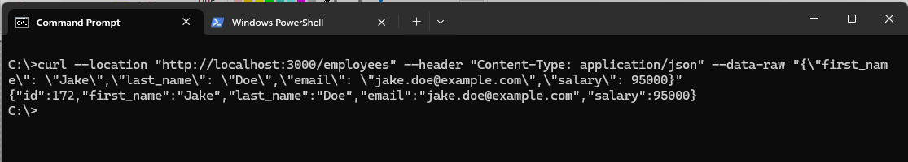

    Create Employee Using Postman

    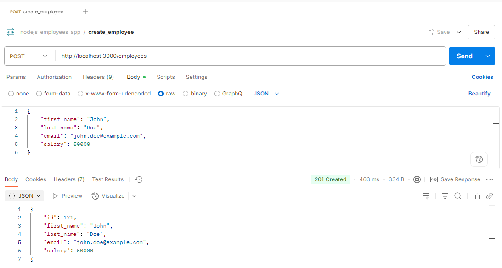
   
    Get All Employees Using Browser

    <http://localhost:3000/employees>

    

    Get All Employees using curl

    ```
    <copy>
    curl http://localhost:3000/employees
    </copy>
    ```

    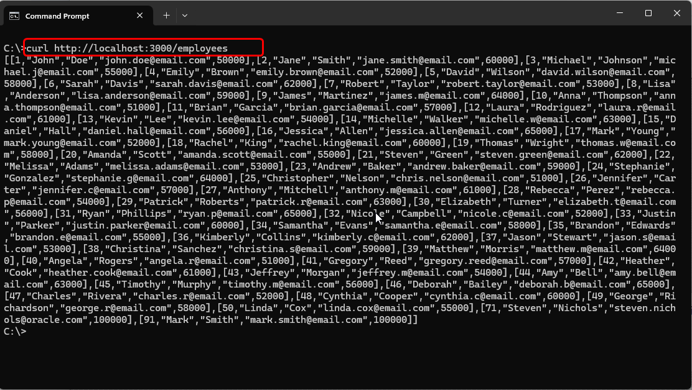

    Get a Specific Employee using Browser

    <http://localhost:3000/employees/25>

    

    Update Employee using curl

    ```
    <copy>
    curl -X PUT --location "http://localhost:3000/employees/25" --header "Content-Type: application/json" --data-raw "{\"first_name\": \"Christopher\",\"last_name\": \"Nelson\",\"email\": \"christopher.nelson@email.com\",\"salary\": 61000}"
    </copy>
    ```

    

    Delete Employee using curl

    ```
    <copy>
    curl -X DELETE http://localhost:3000/employees/91
    </copy>
    ```

    


## Task 8: Python Setup and Sample Application

1. Download and Install Python

    <https://www.python.org/downloads/>

2. Create Folder

    ```
    <copy>
    mkdir c:\adbs_at_azure\oracle_crud_python_app
    cd c:\adbs_at_azure\oracle_crud_python_app
    </copy>
    ```

3. Install Python Libraries **oracledb** and **streamlit** 

    ```
    <copy>
    pip install oracledb streamlit
    </copy>
    ```

4. Create Python File Named **python\_crud\_adbs.py**

    **Note:** Update/Verify Database Username, Password, DSN and Instant Client Path

    ```
    <copy>
    import streamlit as st
    import oracledb
    import pandas as pd

    # Database connection configuration
    DB_USERNAME = "adbsatazure"
    DB_PASSWORD = "password"
    DB_DSN = "adbsatazure_high"

    # Thick Client
    instant_client_dir = r"C:\Oracle\instantclient_23_8"   
    oracledb.init_oracle_client(lib_dir=instant_client_dir)

    # Function to create a database connection
    def get_db_connection():
        try:
            conn = oracledb.connect(
                user=DB_USERNAME,
                password=DB_PASSWORD,
                dsn=DB_DSN
            )
            return conn
        except oracledb.Error as error:
            st.error(f"Error connecting to Oracle Database: {error}")
            return None

    # Function to fetch all employees (Read)
    def fetch_employees():
        conn = get_db_connection()
        if conn:
            try:
                cursor = conn.cursor()
                cursor.execute("SELECT id, first_name, last_name, email, salary FROM employees")
                data = cursor.fetchall()
                columns = ["ID", "First Name", "Last Name", "Email", "Salary"]
                df = pd.DataFrame(data, columns=columns)
                return df
            except oracledb.Error as error:
                st.error(f"Error fetching data: {error}")
                return None
            finally:
                conn.close()

    # Function to add a new employee (Create)
    def add_employee(first_name, last_name, email, salary):
        conn = get_db_connection()
        if conn:
            try:
                cursor = conn.cursor()
                cursor.execute(
                    "INSERT INTO employees (first_name, last_name, email, salary) VALUES (:1, :2, :3, :4)",
                    (first_name, last_name, email, salary)
                )
                conn.commit()
                st.success("Employee added successfully!")
            except oracledb.Error as error:
                st.error(f"Error adding employee: {error}")
            finally:
                conn.close()

    # Function to update an employee (Update)
    def update_employee(id, first_name, last_name, email, salary):
        conn = get_db_connection()
        if conn:
            try:
                cursor = conn.cursor()
                cursor.execute(
                    "UPDATE employees SET first_name = :1, last_name = :2, email = :3, salary = :4 WHERE id = :5",
                    (first_name, last_name, email, salary, id)
                )
                conn.commit()
                st.success("Employee updated successfully!")
            except oracledb.Error as error:
                st.error(f"Error updating employee: {error}")
            finally:
                conn.close()

    # Function to delete an employee (Delete)
    def delete_employee(id):
        conn = get_db_connection()
        if conn:
            try:
                cursor = conn.cursor()
                cursor.execute("DELETE FROM employees WHERE id = :1", (id,))
                conn.commit()
                st.success("Employee deleted successfully!")
            except oracledb.Error as error:
                st.error(f"Error deleting employee: {error}")
            finally:
                conn.close()

    # Streamlit App Layout
    st.title("Oracle Database CRUD Operations")

    # Tabs for different operations
    tab1, tab2, tab3, tab4 = st.tabs(["View Employees", "Add Employee", "Update Employee", "Delete Employee"])

    # Read Operation - View Employees
    with tab1:
        st.header("View All Employees")
        employees_df = fetch_employees()
        if employees_df is not None and not employees_df.empty:
            st.dataframe(employees_df)
        else:
            st.write("No employees found or error occurred.")

    # Create Operation - Add Employee
    with tab2:
        st.header("Add New Employee")
        with st.form("add_employee_form"):
            first_name = st.text_input("First Name")
            last_name = st.text_input("Last Name")
            email = st.text_input("Email")
            salary = st.number_input("Salary", min_value=0, step=100)
            submit_button = st.form_submit_button("Add Employee")
            if submit_button:
                if first_name and last_name and email and salary:
                    add_employee(first_name, last_name, email, salary)
                else:
                    st.error("Please fill in all fields.")

    # Update Operation - Update Employee
    with tab3:
        st.header("Update Employee")
        employees_df = fetch_employees()
        if employees_df is not None and not employees_df.empty:
            employee_id = st.selectbox("Select Employee ID to Update", employees_df["ID"].tolist())
            selected_employee = employees_df[employees_df["ID"] == employee_id].iloc[0]

            with st.form("update_employee_form"):
                first_name = st.text_input("First Name", value=selected_employee["First Name"])
                last_name = st.text_input("Last Name", value=selected_employee["Last Name"])
                email = st.text_input("Email", value=selected_employee["Email"])
                salary = st.number_input("Salary", min_value=0, step=100, value=int(selected_employee["Salary"]))
                update_button = st.form_submit_button("Update Employee")
                if update_button:
                    if first_name and last_name and email and salary:
                        update_employee(employee_id, first_name, last_name, email, salary)
                    else:
                        st.error("Please fill in all fields.")
        else:
            st.write("No employees found to update.")

    # Delete Operation - Delete Employee
    with tab4:
        st.header("Delete Employee")
        employees_df = fetch_employees()
        if employees_df is not None and not employees_df.empty:
            employee_id = st.selectbox("Select Employee ID to Delete", employees_df["ID"].tolist())
            delete_button = st.button("Delete Employee")
            if delete_button:
                delete_employee(employee_id)
        else:
            st.write("No employees found to delete.")

    # Footer
    st.write("---")
    st.write("Streamlit App for Oracle Database CRUD Operations")
    </copy>
    ```

5. Run Python Application

    ```
    <copy>
    streamlit run python_crud_adbs.py
    </copy>
    ```

    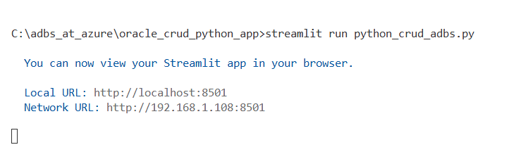

6. Test Python Application

    View All Employees

    

    Add Employee

    

    Update Employee

    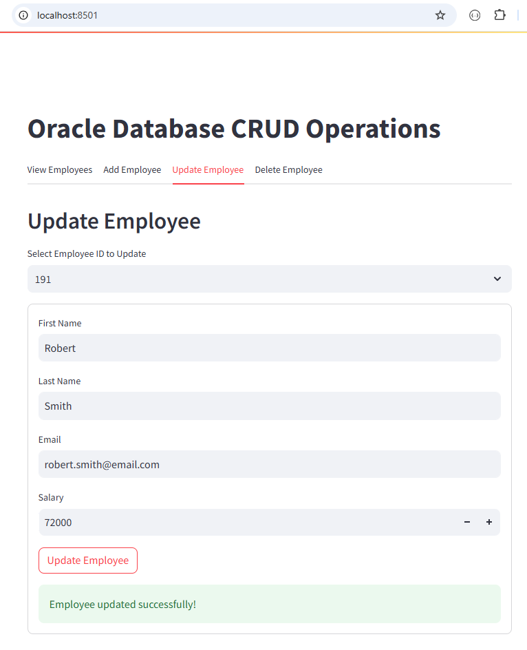

    Delete Employee

    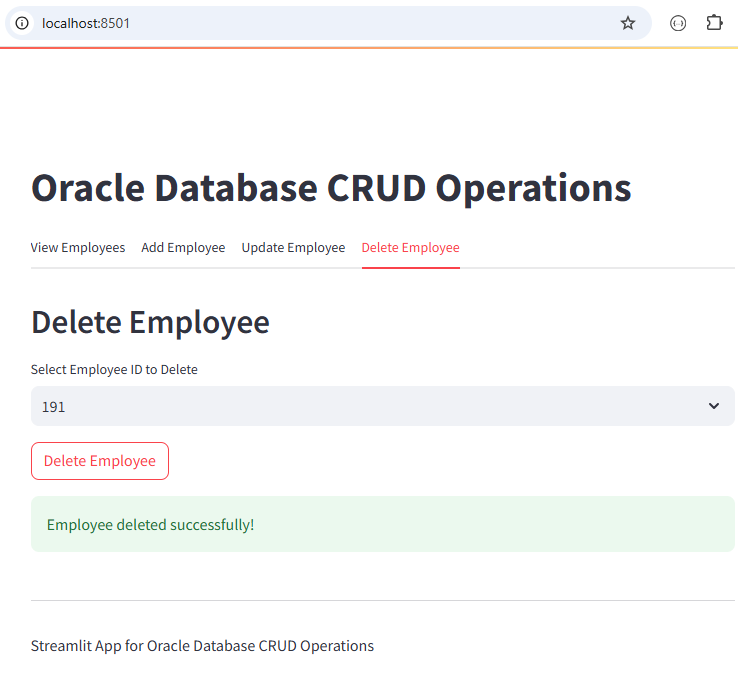

## Task 9: GO Setup and Sample Application

1. Download, Install and Configure GO

    <https://go.dev/dl/>

    ```
    <copy>
    go version
    go env
    set CGO_ENABLED=1
    </copy>
    ```

2. Download and Install UCRT Runtime

    <https://winlibs.com/>

    Extract the downloaded zip archive. Add the bin directory (e.g., C:\\mingw\\bin) to your system's PATH environment variable.

3. Create Working Folder

    ```
    <copy>
    mkdir c:\adbs_at_azure\oracle_crud_go_app
    cd c:\adbs_at_azure\oracle_crud_go_app
    </copy>
    ```

4. Initialize GO environment

    ```
    <copy>
    go mod init adbs_crud
    </copy>
    ```

    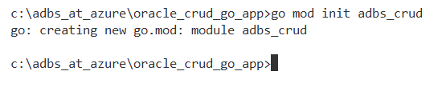

5. Install and List GO Module godror 

    ```
    <copy>
    go get github.com/godror/godror
    </copy>
    ```

    

    ```
    <copy>
    go list github.com/godror/godror
    </copy>
    ```

    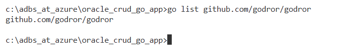

6. Create GO Application File **go\_crud\_adbs.go**

    **Note:** Update/Verify Database Username, Password, connectString, timezone and Instant Client Path (libDir).  You can detemine the database timezone by using the following SQL Statement 

    ```
    <copy>    
    SELECT SESSIONTIMEZONE FROM DUAL;
    </copy>
    ```

    ```
    <copy>
    package main

    import (
        "database/sql"
        "fmt"
        "log"

        _ "github.com/godror/godror"
    )

    // Employee struct to map database table fields
    type Employee struct {
        ID        int
        FirstName string
        LastName  string
        Email     string
        Salary    float64
    }

    func main() {
        // Define the Autonomous Database connection string
        connStr := `user="adbsatazure" password="password" connectString="adbsatazure_high" timezone="America/New_York" libDir="C:\\Oracle\\instantclient_23_8"`

        // Open database connection
        db, err := sql.Open("godror", connStr)
        if err != nil {
            log.Fatal("Error connecting to the database:", err)
        }
        defer db.Close()

        // Test the connection
        err = db.Ping()
        if err != nil {
            log.Fatal("Error pinging the database:", err)
        }

        fmt.Println("Successfully connected to Oracle database!")

        // Example usage of CRUD operations
        // Create
        newEmployee := Employee{
            FirstName: "Pete",
            LastName:  "Doe",
            Email:     "pete.doe@example.com",
            Salary:    75000.50,
        }
        createEmployee(db, newEmployee)

        // Read all employees
        employees := getAllEmployees(db)
        fmt.Println("\nAll Employees:")
        for _, emp := range employees {
            fmt.Printf("ID: %d, Name: %s %s, Email: %s, Salary: %.2f\n",
                emp.ID, emp.FirstName, emp.LastName, emp.Email, emp.Salary)
        }

        // Update
        updateEmployee(db, 25, 80000.00) // Update salary for employee with ID 25

        // Delete
        deleteEmployee(db, 30) // Delete employee with ID 30
    }

    // Create - Insert a new employee
    func createEmployee(db *sql.DB, emp Employee) {
        query := `
            INSERT INTO employees (first_name, last_name, email, salary)
            VALUES (:1, :2, :3, :4)
            RETURNING id INTO :5`

        var newID int
        _, err := db.Exec(query, emp.FirstName, emp.LastName, emp.Email, emp.Salary, sql.Out{Dest: &newID})
        if err != nil {
            log.Printf("Error creating employee: %v", err)
            return
        }
        fmt.Printf("Created employee with ID: %d\n", newID)
    }

    // Read - Get all employees
    func getAllEmployees(db *sql.DB) []Employee {
        query := "SELECT id, first_name, last_name, email, salary FROM employees"
        rows, err := db.Query(query)
        if err != nil {
            log.Printf("Error querying employees: %v", err)
            return nil
        }
        defer rows.Close()

        var employees []Employee
        for rows.Next() {
            var emp Employee
            err := rows.Scan(&emp.ID, &emp.FirstName, &emp.LastName, &emp.Email, &emp.Salary)
            if err != nil {
                log.Printf("Error scanning employee: %v", err)
                continue
            }
            employees = append(employees, emp)
        }

        return employees
    }

    // Read - Get employee by ID
    func getEmployeeByID(db *sql.DB, id int) (Employee, error) {
        query := "SELECT id, first_name, last_name, email, salary FROM employees WHERE id = :1"
        var emp Employee
        err := db.QueryRow(query, id).Scan(&emp.ID, &emp.FirstName, &emp.LastName, &emp.Email, &emp.Salary)
        if err != nil {
            return Employee{}, err
        }
        return emp, nil
    }

    // Update - Update employee salary
    func updateEmployee(db *sql.DB, id int, newSalary float64) {
        query := "UPDATE employees SET salary = :1 WHERE id = :2"
        result, err := db.Exec(query, newSalary, id)
        if err != nil {
            log.Printf("Error updating employee: %v", err)
            return
        }

        rowsAffected, _ := result.RowsAffected()
        fmt.Printf("Updated %d employee(s)\n", rowsAffected)
    }

    // Delete - Delete an employee
    func deleteEmployee(db *sql.DB, id int) {
        query := "DELETE FROM employees WHERE id = :1"
        result, err := db.Exec(query, id)
        if err != nil {
            log.Printf("Error deleting employee: %v", err)
            return
        }

        rowsAffected, _ := result.RowsAffected()
        fmt.Printf("Deleted %d employee(s)\n", rowsAffected)
    }
    </copy>
    ```

7. Run and Test GO Application

    ```
    <copy>
    go run go_crud_adbs.go
    </copy>
    ```

    Add Employee

    

    View All Employees

    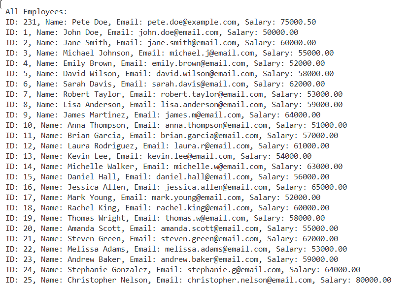

    Update and Delete Employee

    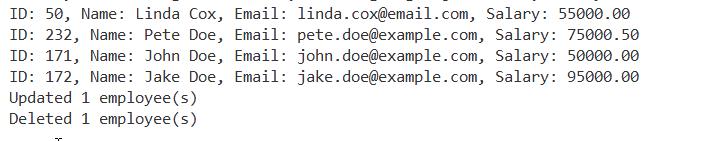

## Task 10: Rust Setup and Sample Application

1. Download, Install and Configure GO

    <https://www.rust-lang.org/tools/install>

    ```
    <copy>
    rustc --version
    cargo --version
    </copy>
    ```
    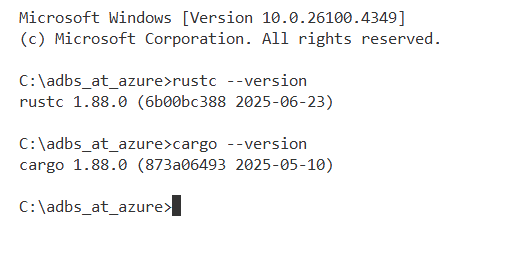
    
2. Create Working Folder

    ```
    <copy>
    mkdir c:\adbs_at_azure\oracle_crud_rust_app
    cd c:\adbs_at_azure\oracle_crud_rust_app
    </copy>
    ```

3. Create New Rust Environment

    ```
    <copy>
    cargo new oracle_crud
    cd oracle_crud
    </copy>
    ```

    

4. Add Oracle Dependency to **Cargo.toml**

    <https://docs.rs/oracle/latest/oracle/>

    ```
    <copy>
    oracle = "0.6.3"
    </copy>
    ```

    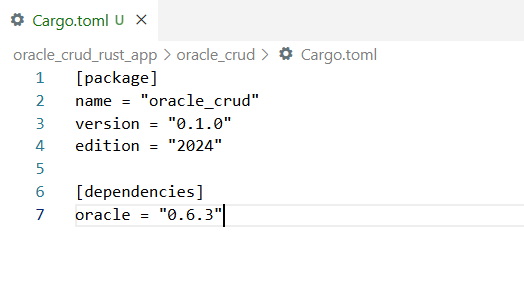

5. Edit Rust Application File **main.rs**

    **Note:** Update/Verify Database Username, Password, connectString.  Also, feel free to update the create, update and delete values.

    ```
    <copy>
    use oracle::{Connection, Row};

    fn main() -> Result<(), oracle::Error> {
        // Replace with your actual Oracle Autonomous Database connection details
        let conn = Connection::connect("adbsatazure", "password", "adbsatazure_high")?;

        // Read
        read_employees(&conn)?;

        // Create
        create_employee(&conn, "John", "Rust", "john.rust@example.com", 50000)?;

        // Update
        update_employee(&conn, 25, 62000)?;

        // Delete
        delete_employee(&conn, 15)?;

        // Read Again after CRUD
        read_employees(&conn)?;

        Ok(())
    }

    fn create_employee(conn: &Connection, first_name: &str, last_name: &str, email: &str, salary: i32) -> Result<(), oracle::Error> {
        let sql = "INSERT INTO employees (first_name, last_name, email, salary) VALUES (:1, :2, :3, :4)";
        let mut stmt = conn.statement(sql).build()?;
        stmt.execute(&[&first_name, &last_name, &email, &salary])?;
        conn.commit()?;
        println!("Created employee: {} {}", first_name, last_name);
        Ok(())
    }

    fn read_employees(conn: &Connection) -> Result<(), oracle::Error> {
        let sql = "SELECT id, first_name, last_name, email, salary FROM employees";
        let mut stmt = conn.statement(sql).build()?;
        let rows = stmt.query(&[])?;

        // Iterate over the rows and display the results
        println!("{:<10} {:<15} {:<15} {:<30} {:<10}", "ID", "First Name", "Last Name", "Email", "Salary");
        println!("{:-<10} {:-<15} {:-<15} {:-<30} {:-<10}", "", "", "", "", "");

        for row_result in rows {
            let row: Row = row_result?;
            let id: i32 = row.get(0)?;
            let first_name: String = row.get(1)?;
            let last_name: String = row.get(2)?;
            let email: String = row.get(3)?;
            let salary: f64 = row.get(4)?;

            println!("{:<10} {:<15} {:<15} {:<30} {:<10.2}", id, first_name, last_name, email, salary);
        }
        Ok(())
    }

    fn update_employee(conn: &Connection, id: i32, salary: i32) -> Result<(), oracle::Error> {
        let sql = "UPDATE employees SET salary = :1 WHERE id = :2";
        let mut stmt = conn.statement(sql).build()?;
        stmt.execute(&[&salary, &id])?;
        conn.commit()?;
        println!("Updated employee ID {}", id);
        Ok(())
    }

    fn delete_employee(conn: &Connection, id: i32) -> Result<(), oracle::Error> {
        let sql = "DELETE FROM employees WHERE id = :1";
        let mut stmt = conn.statement(sql).build()?;
        stmt.execute(&[&id])?;
        conn.commit()?;
        println!("Deleted employee ID {}", id);
        Ok(())
    }
    </copy>
    ```

6. Build, Run and Test Rust Application

    Add the path to the Oracle Instant Client to the Environment Path 

    ```
    <copy>
    SET PATH=C:\oracle\instantclient_23_8;%PATH%
    </copy>
    ```

    

    Build and Run the Rust Application

    ```
    <copy>
    cargo build
    cargo run
    </copy>
    ```

    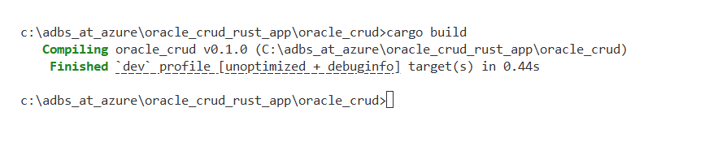

    

    View All Employees

    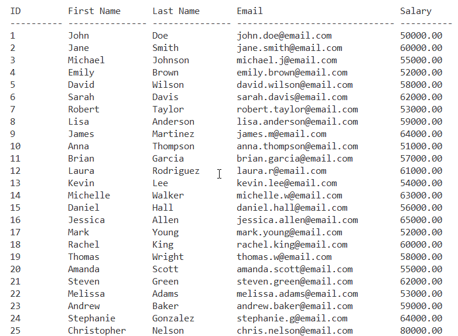

    Create, Update and Delete Employee

    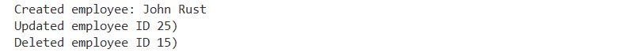

    View All Employees after CRUD

    

## Task 11: Ruby Setup and Sample Application

1. Download, Install and Configure Ruby

    <https://www.ruby-lang.org/en/documentation/installation/>

    <https://rubyinstaller.org/>
    
    <https://www.rubydoc.info/github/kubo/ruby-oci8>

    ```
    <copy>
    gem --version
    </copy>
    ```

    

2. Download and Install Oracle Instant Client SDK

    Unzip the SDK Download into the same directory you installed the Oracle Instant Client in Task 3.

    <https://download.oracle.com/otn_software/nt/instantclient/2380000/instantclient-sdk-windows.x64-23.8.0.25.04.zip>

3. Install Ruby gem **ruby-oci8**


    Add Oracle Instant Client to PATH and Set TNS_ADMIN 

    ```
    <copy>
    SET PATH=C:\oracle\instantclient_23_8;%PATH%
    set TNS_ADMIN=C:\adbs_at_azure\adb_wallets\Wallet_adbsatazure
    </copy>
    ```

    Install Ruby gem ruby-oci8

    ```
    <copy>
    gem install ruby-oci8
    </copy>
    ```

    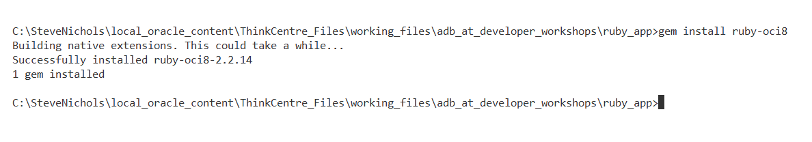    
    
    List the installed Gems

    ```
    <copy>
    gem list
    gem list ruby-oci8
    </copy>
    ```

        

4. Create Working Folder

    ```
    <copy>
    mkdir c:\adbs_at_azure\oracle_crud_ruby_app
    cd c:\adbs_at_azure\oracle_crud_ruby_app
    </copy>
    ```

5. Create Ruby Application File **manage_employees.rb**

    **Note:** Update/Verify Database Username, Password, connectString.

    ```
    <copy>
    require 'oci8'

    class EmployeeManager
      def initialize
        # Connection details for Oracle Autonomous Database
        # Replace with your credentials and connection string
        @username = 'adbsatazure'
        @password = 'password'
        @connection_string = 'adbsatazure_high' # e.g., 'yourdb_high' from tnsnames.ora

        # Establish connection
        begin
          @conn = OCI8.new(@username, @password, @connection_string)
          puts "Successfully connected to Oracle Autonomous Database!"
        rescue OCI8::Exception => e
          puts "Connection failed: #{e.message}"
          exit
        end
      end

      # Create: Insert a new employee
      def create_employee(first_name, last_name, email, salary)
        begin
          # Use a PL/SQL block to insert and return the ID
          plsql = @conn.parse(<<-SQL)
            BEGIN
              INSERT INTO employees (first_name, last_name, email, salary)
              VALUES (:1, :2, :3, :4)
              RETURNING id INTO :5;
            END;
          SQL

          # Bind input parameters
          plsql.bind_param(1, first_name)
          plsql.bind_param(2, last_name)
          plsql.bind_param(3, email)
          plsql.bind_param(4, salary)

          # Bind output parameter for ID (type: Fixnum for NUMBER)
          new_id = nil
          plsql.bind_param(5, new_id, Integer)      

          # Execute the PL/SQL block
          plsql.exec

          # Get the returned ID from the bind variable
          new_id = plsql[5]
          @conn.commit

          puts "Employee created with ID: #{new_id}"
          #return new_id
        rescue OCI8::Exception => e
          puts "Error creating employee: #{e.message}"
        end
      end

      # Read: Retrieve all employees or by ID
      def read_employees(id = nil)
        begin
          if id
            cursor = @conn.exec('SELECT * FROM employees WHERE id = :1', id)
          else
            cursor = @conn.exec('SELECT * FROM employees')
          end

          puts "\nEmployee List:"
          puts "ID | First Name | Last Name | Email | Salary"
          puts "-" * 50
          while row = cursor.fetch
            #puts "#{row[0]} | #{row[1]} | #{row[2]} | #{row[3]} | #{row[4]}"
            puts format("%d | %s | %s | %s | %.2f", row[0], row[1], row[2], row[3], row[4])
          end
        rescue OCI8::Exception => e
          puts "Error reading employees: #{e.message}"
        ensure
          cursor.close if cursor
        end
      end

      # Update: Modify an existing employee's details
      def update_employee(id, first_name, last_name, email, salary)
        begin
          cursor = @conn.exec(
            'UPDATE employees SET first_name = :1, last_name = :2, email = :3, salary = :4 WHERE id = :5',
            first_name, last_name, email, salary, id
          )
          @conn.commit
          puts "Employee with ID #{id} updated successfully."
        rescue OCI8::Exception => e
          puts "Error updating employee: #{e.message}"
        end
      end

      # Delete: Remove an employee by ID
      def delete_employee(id)
        begin
          cursor = @conn.exec('DELETE FROM employees WHERE id = :1', id)
          @conn.commit
          puts "Employee with ID #{id} deleted successfully."
        rescue OCI8::Exception => e
          puts "Error deleting employee: #{e.message}"
        end
      end

      # Close the database connection
      def close_connection
        @conn.logoff if @conn
        puts "Database connection closed."
      end
    end

    # Example usage with a simple command-line interface
    def main
      emp_mgr = EmployeeManager.new

      loop do
        puts "\nEmployee Management System"
        puts "1. Create Employee"
        puts "2. Read All Employees"
        puts "3. Read Employee by ID"
        puts "4. Update Employee"
        puts "5. Delete Employee"
        puts "6. Exit"
        print "Choose an option: "

        choice = gets.chomp.to_i

        case choice
        when 1
          print "Enter First Name: "
          first_name = gets.chomp
          print "Enter Last Name: "
          last_name = gets.chomp
          print "Enter Email: "
          email = gets.chomp
          print "Enter Salary: "
          salary = gets.chomp.to_f
          emp_mgr.create_employee(first_name, last_name, email, salary)

        when 2
          emp_mgr.read_employees

        when 3
          print "Enter Employee ID: "
          id = gets.chomp.to_i
          emp_mgr.read_employees(id)

        when 4
          print "Enter Employee ID to update: "
          id = gets.chomp.to_i
          print "Enter new First Name: "
          first_name = gets.chomp
          print "Enter new Last Name: "
          last_name = gets.chomp
          print "Enter new Email: "
          email = gets.chomp
          print "Enter new Salary: "
          salary = gets.chomp.to_f
          emp_mgr.update_employee(id, first_name, last_name, email, salary)

        when 5
          print "Enter Employee ID to delete: "
          id = gets.chomp.to_i
          emp_mgr.delete_employee(id)

        when 6
          emp_mgr.close_connection
          puts "Exiting application."
          break

        else
          puts "Invalid option. Please try again."
        end
      end
    end

    # Run the application
    if __FILE__ == $PROGRAM_NAME
      main
    end
    </copy>
    ```

6. Run the Ruby Application

    Add the path to the Oracle Instant Client to the Environment Path and Set TNS_ADMIN 

    ```
    <copy>
    SET PATH=C:\oracle\instantclient_23_8;%PATH%
    set TNS_ADMIN=C:\adbs_at_azure\adb_wallets\Wallet_adbsatazure    
    </copy>
    ```

    Set the **NLS_LANG** Environment Variable.  Use the below SQL to determine your Autonomous Database NLS Settings

    ```
    <copy>
    SELECT LISTAGG(value, '.') WITHIN GROUP (ORDER BY DECODE(parameter, 'NLS_LANGUAGE', 1, 'NLS_TERRITORY', 2, 'NLS_CHARACTERSET', 3)) 
      AS nls_lang
    FROM nls_database_parameters 
    WHERE parameter IN ('NLS_LANGUAGE', 'NLS_TERRITORY', 'NLS_CHARACTERSET');
    </copy>
    ```    

    

    ```
    <copy>
    set NLS_LANG=AMERICAN_AMERICA.AL32UTF8
    </copy>
    ```

    Verify Environment is Ready
    
    ```
    <copy>
    echo %PATH%
    echo %TNS_ADMIN%
    echo %NLS_LANG%
    </copy>
    ```    

    

    Run the Ruby Application

    ```
    <copy>
    ruby manage_employees.rb
    </copy>
    ```

    

7. Test Ruby Application

    View All Employees

    

    View Employee by ID

    

    Create Employee

    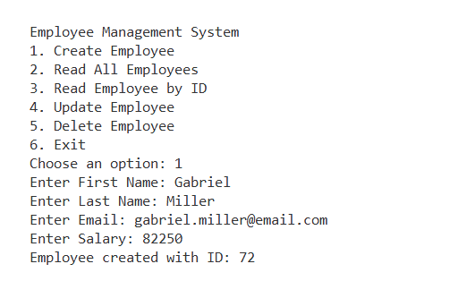

    Update Employee

    

    Delete Employee

    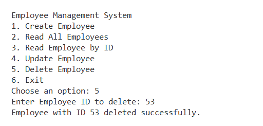

## Sourced Material
Portions of the introduction were sourced from [here](https://docs.oracle.com/en-us/iaas/Content/database-at-azure/oaa.htm)

## Acknowledgements
  * **Authors:** Steven Nichols, Master Principal Cloud Architect
  * **Last Updated By/Date:** Steven Nichols, November 5, 2025

Copyright (C)  Oracle Corporation.

Permission is granted to copy, distribute and/or modify this document
under the terms of the GNU Free Documentation License, Version 1.3
or any later version published by the Free Software Foundation;
with no Invariant Sections, no Front-Cover Texts, and no Back-Cover Texts.
A copy of the license is included in the section entitled [GNU Free Documentation License](files/gnu-free-documentation-license.txt)