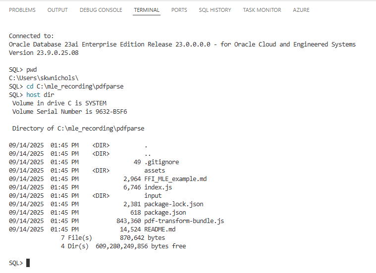
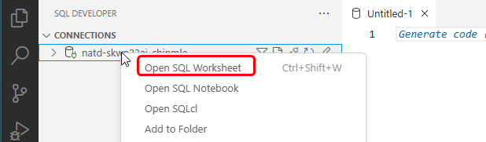
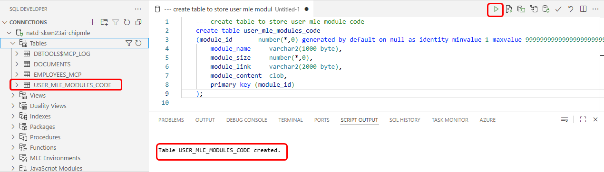

# Oracle Database Multilingual Engine (MLE)

## Introduction

Oracle Database supports a rich set of languages for writing user-defined functions and stored procedures, including PL/SQL, Java, and C. With Oracle Database Multilingual Engine (MLE), developers have the option to run JavaScript code through dynamic execution or with persistent MLE modules stored directly in the database.

The landscape of programming languages is rapidly evolving, with more developers choosing to use modern dynamic languages like JavaScript. Besides simpler syntax and support for modern language features, a key factor in the popularity of these languages is the existence of a rich module ecosystem. Developers often choose to use different languages to implement different parts of a project, based on the availability of suitable modules for the given task.

Whether or not a new language reaches widespread adoption frequently depends on community involvement. Once a language reaches some threshold of popularity, its ecosystem often starts expanding rapidly, attracting more and more developers. Many times, a rich set of features, libraries, and reusable code modules are created to support more widespread use.

The Oracle Database is renowned for its support of a rich ecosystem of programming languages. The most common programmatic server-side interface to the Oracle Database is PL/SQL. By using PL/SQL it is possible to keep business logic and data together, oftentimes offering significant improvements to efficiency in addition to providing a unified processing pattern for data, regardless of the client interface in use. With MLE, you can utilize PL/SQL to implement JavaScript modules, offering an additional avenue to interact directly with the database.

The above introduction was source from Oracle Documentation located [here](https://docs.oracle.com/en/database/oracle/oracle-database/23/mlejs/introduction-to-mle.html).

## Documentation Links

[Oracle Database Multilingual Engine for JavaScript TOC](https://docs.oracle.com/en/database/oracle/oracle-database/23/mlejs/toc.htm)

[Oracle Sample MLE Modules](https://oracle-samples.github.io/mle-modules/)

[Oracle SQL Developer for VS Code](https://docs.oracle.com/en/database/oracle/sql-developer-vscode/index.html)

[SQLcl MLE Command Reference](https://docs.oracle.com/en/database/oracle/sql-developer-command-line/25.2/sqcug/mle.html)

## Prerequisites - Initial MLE Setup and Deployment by Chip Baber

Please complete the initial MLE setup as demonstrated and document by Chip Baber in the following YouTube Recording here.  Chip leverages an Oracle APEX Workspace and Application to complete the MLE setup and deployment of an MLE Module, Environment and Javascript based database functions.

[How to Parse a Page from a PDF inside 23ai Leveraging the Multi-lingual Engine](youtube:o9NTFNzxscA)

The Sample code for all steps in the recording can be found here: 

[Initial MLE Setup by Chip Baber Sample Code](https://github.com/chipbaber/pdfparse)

In this recording we will show how to quickly create a node.js function that inputs a pdf and outputs the number of pages inside the pdf as well as parses out a page of the pdf. We will then load the javascript code directly into the 23ai database and show how easy it is to leverage the Oracle Database Multi-lingual Engine to execute the code, wrap the code inside a  database function and call from PL/SQL. 

During this demo you will learn how to: 
* Create a Oracle Autonomous Database on Oracle Cloud Infrastructure
* Create a Oracle Application Express Workspace
* Create a database user
* Grant privileges to a database user
* Run Queries and Javascript Code inside Oracle APEX SQL Worksheet
* Upload javascript code to Oracle Transaction Processing Autonomous Database 
* Create a MLE Module and Environment
* Execute Javascript as a Oracle Function
* Query the number of pages in a PDF
* Extract a single page from a PDF as a new PDF
* Save a PDF to Oracle Cloud Infrastructure Object Storage
* Save a PDF to a Binary Large Object inside a Oracle Table

## Task 2: MLE Deployment: VS Code SQL Developer Extension and SQLcl

1. Clone Chip's Github Repository

    Open new terminal window in VS Code

    

    Create/Change directory (cd) to the desired directory

	```
    <copy>
    mkdir C:\mle_recording
    cd C:\mle_recording 
	</copy>
	```

    

    Execute the following git clone command

	```
    <copy>
    git clone https://github.com/chipbaber/pdfparse.git
	</copy>
	```

    

2. Create MLE Module

    Right-click on desired SQL Developer Connection, select Open SQLcl

    

    Change Directory to the **pdfparse** directory of the github repository

	```
    <copy>
    pwd
    cd C:\mle_recording\pdfparse 
    host dir
	</copy>
	```

    

    Execute the following SQLcl Command

	```
    <copy>
    mle create-module -module-name PDFLIB_MODULE2 -filename pdf-transform-bundle.js -replace
	</copy>
	```

    

    **Note:** [SQLcl MLE Command Reference](https://docs.oracle.com/en/database/oracle/sql-developer-command-line/25.2/sqcug/mle.html)

    Expand SQL Developer Connection, JavaScript Modules and verify 

        

3. Create MLE Environment

    Expand SQL Developer Connection, click the + next to MLE Environments, enter a **name** and click **Apply**

        

    Expand MLE Environments, right-click on desired MLE Environment and select **Add Imports...** , select **Module Name** from dropdown, enter **Import Name** and click **Apply**

        

4. Create and Test MLE based Database Functions

    Open SQL Worksheet, Right-Click on Connection and Select **Open SQL Worksheet**

        

    Create Database Function and then Expand Functions to verify PDFPAGECOUNT2 was created

	```
    <copy>
    create or replace function pdfPageCount2(inPDF in blob) return number as mle module PDFLIB_MODULE2 env PDF_TRANSFORM2 signature 'pdfPageCountUnit8Array(Uint8Array)';
	</copy>
	```

        

    Execute SQL Statement to test MLE Database Function

	```
    <copy>
    select file_name, pdfPageCount2(file_content) file_page_count 
    from documents
    where id = 21;
	</copy>
	```

        

## Task 3: MLE Deployment: Native SQL and PL/SQL Commands

1. Open VS Code, Right-click on SQL Developer Connection, select Open SQL Worksheet

        

2. Create Table to Store MLE Module written and package by Chip

	```
    <copy>
    --- create table to store user mle module code
    create table user_mle_modules_code
    (module_id       number(*,0) generated by default on null as identity minvalue 1 maxvalue 9999999999999999999999999999 increment by 1 start with 1 cache 20 noorder  nocycle  nokeep  noscale  not null enable, 
        module_name     varchar2(1000 byte), 
        module_size     number(*,0), 
        module_link     varchar2(2000 byte), 
        module_content  clob,
        primary key (module_id)
    );    
	</copy>
	```

        

2. Create MLE Module and Envioronment using the following PL/SQL Script

	```
    <copy>
    --- read javascript code from github, insert code into table and create mle module and environment 
    set SERVEROUTPUT on;
    declare
        getfile_resp    dbms_cloud_types.RESP;
        file_url        varchar2(200)  := 'https://raw.githubusercontent.com/chipbaber/pdfparse/refs/heads/main/pdf-transform-bundle.js';
        mod_name        varchar2(200)  := 'PDFLIB_MODULE3';
        env_name        varchar2(200)  := 'PDF_TRANSFORM3';
        file_contents   CLOB := NULL;
        create_mle_mod_statement varchar2(2000);
        create_mle_env_statement varchar2(2000);
    begin
        -- Get External File
        getfile_resp := dbms_cloud.send_request(uri => file_url, method => dbms_cloud.METHOD_GET);
        file_contents := dbms_cloud.get_response_text(getfile_resp);
        dbms_output.put_line('Javascript Code Retrieved From: ' || file_url);
        
        -- Insert MLE Code into user table
        insert into user_mle_modules_code(module_name,module_size,module_link,module_content) 
                values(mod_name,length(file_contents),file_url,file_contents);
        commit;
        dbms_output.put_line('Javascript Code Inserted Into Table: user_mle_modules_code');

        -- Create MLE Module
        create_mle_mod_statement := 'create or replace mle module '|| mod_name || ' language javascript using clob select module_content from user_mle_modules_code where module_name = ' || '''' || mod_name || '''';
        begin
            execute IMMEDIATE create_mle_mod_statement;
            commit;
        end;
        dbms_output.put_line('MLE Module Created:' || create_mle_mod_statement);

        -- Create MLE Environment
        create_mle_env_statement := 'create or replace mle env '|| env_name || ' imports (' || '''' || mod_name || '''' || ' module ' || mod_name || ')'; 
        begin
            execute IMMEDIATE create_mle_env_statement;
            commit;
        end;
        dbms_output.put_line('MLE Environment Created: ' || create_mle_env_statement);        
    end;
    /
	</copy>
	```

        

    You can view the record inserted into the table **user_mle_modules_code**

        

4. Create and Test Javascript based Database Functions

    Create Database Function and then Expand Functions to verify PDFPAGECOUNT3 was created

	```
    <copy>
    create or replace function  pdfPageCount3(inPDF in blob) return number as mle module PDFLIB_MODULE3 env PDF_TRANSFORM3 signature 'pdfPageCountUnit8Array(Uint8Array)';
	</copy>
	```

        

    Execute SQL Statement to test MLE Database Function

	```
    <copy>
    select file_name, pdfPageCount3(file_content) file_page_count 
    from documents
    where id = 21;
	</copy>
	```

        

## Acknowledgements
  * **Author:** Steven Nichols, Master Principal Cloud Architect
  * **Last Updated By/Date:** Steven Nichols, September 14, 2025

Copyright (C)  Oracle Corporation.

Permission is granted to copy, distribute and/or modify this document
under the terms of the GNU Free Documentation License, Version 1.3
or any later version published by the Free Software Foundation;
with no Invariant Sections, no Front-Cover Texts, and no Back-Cover Texts.
A copy of the license is included in the section entitled [GNU Free Documentation License](files/gnu-free-documentation-license.txt)